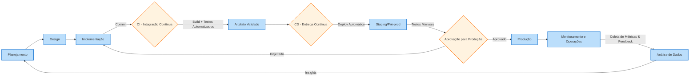

# Day-01 | Os Alicerces — Por que CI/CD importa?

---

## **📌 Objetivos de Aprendizado**  

- Compreender o que significa CI/CD e de onde surgiu  
- Reconhecer os problemas do desenvolvimento de software sem automação  
- Entender como CI/CD se conecta ao movimento DevOps  
- Identificar os benefícios de integrar CI/CD no ciclo de vida do software  

---

## 🏗️ Por que falar em “alicerces”?

Antes de construir qualquer casa, precisamos de **fundação sólida**.  
No mundo do desenvolvimento de software, essa fundação são as práticas que garantem que o código não seja apenas escrito, mas também:  
- validado,  
- integrado,  
- entregue com qualidade.  

Esse é o papel do **CI/CD**: ser o alicerce do ciclo de desenvolvimento.  

---

## 🔙 O contexto histórico

No passado, o ciclo de desenvolvimento de software era longo e pesado:  
- Projetos levavam **meses ou anos** para entregar uma versão.  
- O código de diferentes desenvolvedores ficava isolado por muito tempo.  
- As entregas em produção eram eventos raros e de alto risco.  

Esse modelo gerava:  
- **Integrações complexas e dolorosas**  
- **Erros descobertos tarde demais**  
- **Clientes frustrados** pela demora em receber novidades

Foi nesse cenário que surgiram práticas para encurtar ciclos, trazer visibilidade e reduzir riscos. A resposta? **Integração Contínua e Entrega Contínua**.  

---

## 🔄 O que é CI/CD?

CI/CD é um conjunto de práticas que busca **tornar o processo de desenvolvimento mais ágil, confiável e previsível**.  
Ele se divide em duas grandes áreas:  

### CI – Integração Contínua
- Desenvolvedores integram código frequentemente em um repositório compartilhado.  
- Cada integração dispara validações automáticas (builds e testes).  
- O objetivo é detectar erros cedo, antes que cresçam.  

👉 **Benefício chave:** menos surpresas e menos conflitos acumulados.  

### CD – Entrega/Implantação Contínua

- Automatiza a **entrega de código validado** para ambientes específicos (teste, staging, produção)

- Duas vertentes principais:
    - _Continuous Delivery_: Pronto para implantação manual a qualquer momento
    - _Continuous Deployment_: Implantação automática após testes bem-sucedidos
- **Práticas essenciais:**
    - Pipeline de implantação unificado
    - Gerenciamento de ambientes consistente
    - Rollback automático em falhas

👉 **Benefício chave:** redução de riscos em releases e feedback rápido dos usuários

🔗 **CI + CD =** Ciclo completo de desenvolvimento ágil: do commit ao deploy em minutos!

---

### CD – Entrega Contínua vs Implantação Contínua

**Entrega Contínua (Continuous Delivery)**  
- Garante que o sistema esteja sempre **pronto para ser colocado em produção**.  
- O deploy ainda depende de uma decisão humana.  
- Reduz a ansiedade do “grande lançamento”: tudo já está preparado.  

**Implantação Contínua (Continuous Deployment)**  
- É a evolução da entrega contínua.  
- Toda mudança aprovada segue **automaticamente até a produção**.  
- Requer confiança total nos testes e automações.  

👉 **Diferença resumida:**  
- *Entrega Contínua* = pronto para publicar  
- *Implantação Contínua* = publicado automaticamente  

---

## 🔗 A conexão com o DevOps

O CI/CD é um dos pilares do movimento **DevOps**, que busca aproximar desenvolvimento e operações.  
Enquanto DevOps é a **cultura** que incentiva colaboração, CI/CD é a **ferramenta prática** que dá suporte a essa cultura.  

Sem CI/CD, o DevOps fica apenas no discurso.  
Com CI/CD, ele se torna realidade, porque:  
- o código flui com mais rapidez,  
- os feedbacks são imediatos,  
- e as equipes trabalham em harmonia.  

---

## 🚀 Benefícios em adotar CI/CD

- **Ciclos curtos de entrega** → versões chegam rápido aos usuários  
- **Feedback rápido** → desenvolvedores sabem em minutos se algo quebrou  
- **Qualidade contínua** → falhas são detectadas cedo  
- **Padronização de processos** → menos improviso, mais confiança  
- **Menos riscos** → deploys pequenos e frequentes reduzem impacto de erros  
- **Confiança do cliente** → atualizações constantes mostram evolução contínua  

---

## 🧩 O papel do CI/CD nos “alicerces”

CI/CD não é apenas uma ferramenta ou buzzword:  
- Ele representa uma **mudança de mentalidade** sobre como lidar com código e entregas.  
- É o **ponto de partida** para práticas mais avançadas em DevOps, automação de infraestrutura, testes e observabilidade.  
- Sem CI/CD, o ciclo moderno de software fica instável, assim como uma casa construída sem fundação. 

---

## 🔄 Ciclo de Vida do Desenvolvimento de Software + CI/CD

### O que é o Ciclo de Vida do Software?

É o processo estruturado para construir, entregar e manter aplicações, composto por 6 fases principais:

1. **Requisitos & Planejamento**
    
    - Definição de funcionalidades
    - Priorização de tarefas
    - Estimativas de tempo e recursos
2. **Design & Arquitetura**
    
    - Modelagem do sistema
    - Definição de tecnologias
    - Padrões de código e infraestrutura
3. **Implementação**
    
    - Codificação das funcionalidades
    - Versionamento com Git
    - Revisões de código pares
4. **Verificação**
    
    - Testes manuais/automáticos
    - Validação de requisitos
    - Análise de segurança e performance
5. **Implantação**
    
    - Deploy em ambientes
    - Configuração de infraestrutura
    - Liberação para usuários
6. **Manutenção**
    
    - Correção de bugs
    - Atualizações de segurança
    - Melhorias contínuas

---

## ⚡ Onde o CI/CD se encaixa?

O CI/CD atua como **coluna vertebral** das fases 3 a 6, acelerando e automatizando o fluxo:

### Mapeamento Detalhado

|Fase do Ciclo|Atividades Tradicionais|Com CI/CD|Benefício Chave|
|---|---|---|---|
|**Implementação**|Código em branches longas|→ Commits frequentes em trunk|↓ Conflitos de merge|
||Builds manuais ocasionais|→ Build automático por commit|↓ "Funciona na minha máquina"|
|**Verificação**|Testes no final do ciclo|→ Testes automatizados em pipeline|↓ Bugs em produção|
||Validação manual demorada|→ Feedback em minutos|↑ Velocidade de correção|
|**Implantação**|Deploy complexo e arriscado|→ Pipeline de entrega unificado|↓ Tempo de release|
||Rollback manual|→ Reversão automática|↑ Confiabilidade|
|**Manutenção**|Monitoramento reativo|→ Observabilidade integrada|↑ Detecção proativa de issues|
||Atualizações esporádicas|→ Releases contínuas|↑ Valor entregue ao usuário|

---

### Fluxo Integrado CI/CD no Ciclo

**Ponto Crítico:** O CI/CD elimina gargalos entre desenvolvimento e operações, criando um ciclo virtuoso onde cada mudança flui suavemente da ideia à produção.

---

## 🛠️ CI/CD como Acelerador do Ciclo

1. **Na Implementação**
    
    - _Ferramentas:_ Git, SonarQube
    - _Prática:_ Merge Requests com verificações automáticas
2. **Na Verificação**
    
    - _Ferramentas:_ Jest, Selenium, LoadRunner
    - _Prática:_ Pipeline paralelizado com testes em containers
3. **Na Implantação**
    
    - _Ferramentas:_ Jenkins, ArgoCD, Terraform
    - _Prática:_ Deploy canário com métricas em tempo real
4. **Na Manutenção**
    
    - _Ferramentas:_ Prometheus, New Relic
    - _Prática:_ Auto-scaling baseado em métricas

---

## ✅ Checklist de Aprendizado

- [x] Entendo o contexto histórico que levou ao surgimento do CI/CD  
- [x] Sei explicar, em termos simples, o que é Integração Contínua  
- [x] Sei diferenciar Entrega Contínua de Implantação Contínua  
- [x] Reconheço como CI/CD se conecta ao DevOps  
- [x] Consigo citar os principais benefícios de adotar CI/CD  

---

## 🔗 Recursos de Apoio

| Tipo      | Link                                                                                          | Descrição                           |
| --------- | --------------------------------------------------------------------------------------------- | ----------------------------------- |
| 🎥 Vídeo  | [CI/CD - Integração Continua e Entrega Continua](https://www.youtube.com/watch?v=TnOnlpHGxJE) | Explicação em 5 minutos (portugues) |
| 🎥 Vídeo  | [O que é CI/CD?](https://www.youtube.com/watch?v=hgkk70nGLk0)                                 | Robert Silva                        |
| 🎥 Vídeo  | [O que é CI/CD?](https://www.redhat.com/pt-br/topics/devops/what-is-ci-cd)                    | Fabricio Veronez                    |

---

> **🏠 Voltar ao Índice:** [Índice do Curso](home.html)  
> **➡️ Próximo:** [Day-02 - Fundamentos do Git e Versionamento](02.html)
> 
