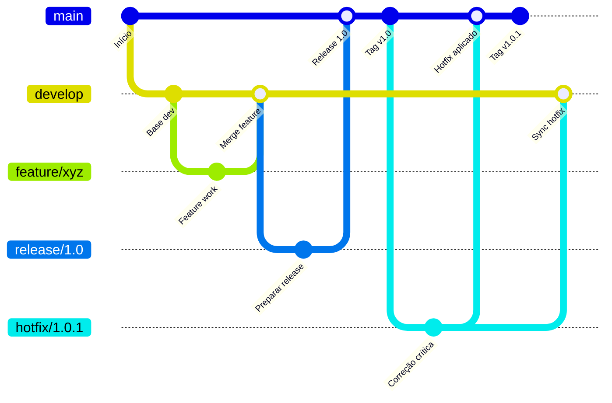
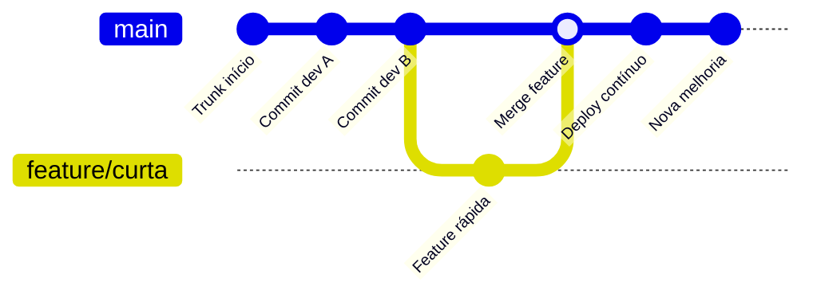
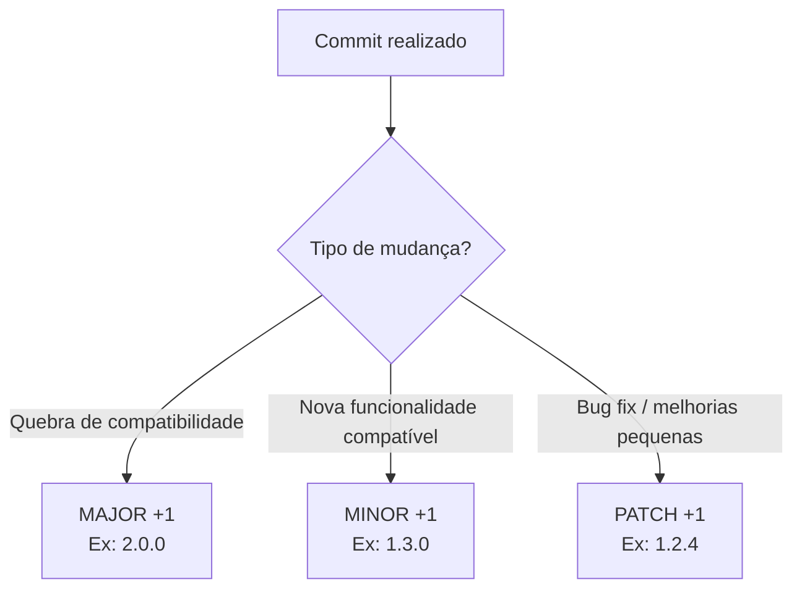

# Day-02 | Controlando a Bagunça - Versionamento e Colaboração

---

## 📌 Objetivos de Aprendizado 
s
- Compreender as diferenças fundamentais entre Git Flow e Trunk-Based Development
- Entendimento do Semantic Versioning em seus projetos
- Entendimento do Conventional Commits para padronização de mensagens
- Entender a importância dos commits atômicos no fluxo de CI/CD
- Relacionar práticas de versionamento com a eficiência dos pipelines

---

## 🧩 Por que versionamento importa para CI/CD?

O controle de versão é a **espinha dorsal** que sustenta todo processo de CI/CD. Sem ele:  
- Não há como rastrear mudanças  
- Colaboração torna-se caótica  
- Implantações ficam imprevisíveis  

---

## 🔀 Git Workflows: Filosofias em confronto

Quando falamos em desenvolvimento colaborativo com Git, existem diferentes estratégias para organizar o fluxo de trabalho.  
Duas das mais conhecidas são **Git Flow** e **Trunk-Based Development**.  
Ambas têm o mesmo objetivo — garantir colaboração eficiente e qualidade no código — mas seguem filosofias bem diferentes.

---

### 🧩 O que é Git Flow?
O **Git Flow** é um modelo de ramificação proposto por Vincent Driessen em 2010.  
Ele introduz uma **estrutura hierárquica de branches**, onde cada tipo de branch tem um papel definido:

- `main` (ou `master`) → mantém a versão estável em produção.  
- `develop` → concentra o desenvolvimento ativo.  
- `feature/*` → criadas para novas funcionalidades.  
- `release/*` → preparação de versões para produção.  
- `hotfix/*` → correções rápidas em produção.  

📌 **Características principais**:
- Adequado para projetos com **ciclos de release mais longos**.  
- Favorece produtos que precisam **manter múltiplas versões em paralelo**.  
- Garante maior **controle de versionamento**, mas com custo de **complexidade**.  

---

### 📊 Fluxo Git Flow (Mermaid)

---
### 🌱 O que é Trunk-Based Development?
O **Trunk-Based Development (TBD)** é uma abordagem mais enxuta e ágil.  
Em vez de várias branches, os desenvolvedores trabalham quase sempre em uma única branch principal, chamada de **trunk** (ou `main`).  

- Todos os desenvolvedores integram mudanças diretamente (ou via pull requests curtos).  
- Branches de feature existem, mas são **curtas e de curta duração** (horas ou poucos dias).  
- A filosofia é baseada em **integração contínua e entregas frequentes**.  

📌 **Características principais**:
- Adequado para equipes com **CI/CD bem estabelecido**.  
- Requer **alta disciplina** em testes automatizados e code reviews rápidos.  
- Favorece **deploys frequentes e menores**, reduzindo riscos.  

---

### 📊 Fluxo Trunk-Based Development (Mermaid)

---

### ⚖️ Comparação lado a lado

| Característica    | Git Flow                       | Trunk-Based Development        |
| ----------------- | ------------------------------ | ------------------------------ |
| **Estrutura**     | Branches longas (dev, release) | Branch principal única (trunk) |
| **Integração**    | Merges periódicos              | Commits frequentes e pequenos  |
| **Indicado para** | Projetos com versões paralelas | Equipes maduras e CI/CD sólido |
| **Vantagem**      | Controle rigoroso de versões   | Integração contínua natural    |
| **Desvantagem**   | Complexidade de gerenciamento  | Requer disciplina e automação  |

---

### 📌 Quando usar cada um?
- **Git Flow** → indicado para **sistemas legados** ou **produtos com múltiplas versões** em produção.  
- **Trunk-Based Development** → ideal para **startups, microsserviços** e **times ágeis com deploy contínuo**.  

---
## 🔢 Semantic Versioning (SemVer): A matemática das versões

O **Semantic Versioning** (SemVer) é um padrão de versionamento criado para trazer **clareza e previsibilidade** na evolução de software.  
Ele segue a lógica **MAJOR.MINOR.PATCH**, por exemplo: `2.5.3`.  

### O que é e por que usar

- **MAJOR (X.0.0):** Mudanças incompatíveis que podem quebrar aplicações que dependem da versão anterior.  
- **MINOR (0.X.0):** Funcionalidades novas que não afetam compatibilidade.  
- **PATCH (0.0.X):** Correções de bugs e pequenas melhorias que não alteram funcionalidades.  

**Por que isso importa?**  
- Comunicação clara entre desenvolvedores e usuários.  
- Previsibilidade no impacto de uma atualização.  
- Compatibilidade garantida em ambientes de produção.  

### Regras e boas práticas

1. **Imutabilidade:** uma versão publicada nunca deve mudar.  
2. **Transparência:** cada incremento deve refletir exatamente o impacto da mudança.  
3. **Automação:** pipelines podem interpretar números de versão e decidir sobre deploys.  
4. **Metadados:** podem ser adicionados ao final (ex: `1.2.3+20230911`) para build tracking.  

### Riscos de não aplicar corretamente

- Dependências quebradas em produção.  
- Dificuldade em identificar de onde surgiu um bug.  
- Equipes perdem confiança no processo de release.  
- Pipelines deixam de ser previsíveis.  

---

### 📊 Fluxo de Decisão SemVer (Mermaid)

## ✨ Cultura do Commit Saudável

### 💡 Conventional Commits: Padronizando Mensagens

O **Conventional Commits** é uma convenção simples e amplamente adotada para escrever mensagens de commit de forma padronizada, clara e automatizável. Ele estabelece um formato consistente que facilita a leitura do histórico e a automação de processos.

#### **📖 Mensagem de Commit - Guia Detalhado**

Uma boa mensagem de commit funciona como um GPS para o histórico do projeto. Ela precisa ser **clara, objetiva e autoexplicativa**, permitindo que qualquer colaborador entenda a mudança sem precisar decifrar o código. 

💡 **Dica:** Na hora de Criar mensagem de commit, imagine que voce está continuando essa frase `Se eu aplicar esse commit, ele vai...`

Segue um guia prático:

**Estrutura Ideal**  
Use o formato: `tipo(escopo-opcional): descrição concisa`  
- **Tipo**: Indica a natureza da mudança (ex: feat, fix, docs)  
- **Escopo**: Especifica o módulo/área afetada (opcional)  
- **Descrição**: Explica a mudança em tempo presente ("Adiciona" em vez de "Adicionei")

**Exemplos Ampliados**  
1. `feat(layout): adicionar suporte para exportação em TXT`  
   *(Novo recurso no módulo de layout, útil para integração com sistemas legados)*  

2. `fix(autenticação): corrigir timeout na comunicação com WebSocket`  
   *(Resolve erro crítico que causava desconexões após 2min de inatividade)*  

3. `test(pagamento): adicionar suite de testes para API de cartões`  
   *(Cobre cenários de edge cases como CVV inválido e cartões expirados)*  

4. `ci: atualizar versão do Node.js para 18.x no pipeline`  
   *(Melhoria de infraestrutura que resolve vulnerabilidades de segurança)*  

**Boas Práticas**  
✔️ Use verbos no imperativo ("Corrigir" em vez de "Corrigindo")  
✔️ Limite a 50 caracteres no título  
✔️ Detalhe o "porquê" no corpo da mensagem quando necessário  
✔️ Referencie issues/tickets (ex: `JIRA-123`)  

**Tipos Comuns**  
- `feat`: Novas funcionalidades  
- `fix`: Correções de bugs  
- `docs`: Atualizações documentais  
- `refactor`: Melhorias de código sem mudar funcionalidades  
- `chore`: Tarefas de manutenção (dependências, configurações) 
- `ci`: Ajustes relacionado ao CI do projeto

💡 **Dica extra:** Mantenha consistência nos emojis caso utilize (ex: 🐛 para bugs, ✨ para novas features), mas evite exageros. Uma mensagem bem escrita economiza horas de debugging e facilita o code review!

### 🚀 Benefícios para Equipes e Pipelines

- **📖 Histórico Legível:** Facilita a auditoria e o entendimento da evolução do código. 
- **🤖 Geração Automatizada de Changelog:** Ferramentas como `standard-version` ou `semantic-release` podem gerar notas de versão automaticamente. 
- **🔁 Integração com CI/CD:** Commits específicos podem acionar etapas seletivas em pipelines de integração e deploy. 
- **📌 Rastreabilidade:** Permite vincular commits a issues, tarefas ou itens do backlog.   
- **🧠 Onboarding Acelerado:** Novos membros do time compreendem o histórico do projeto mais rapidamente.
    

---

## ⚡ Atomicidade: A Arte do Commit Perfeito

### 🔍 Princípios dos Commits Atômicos

1. **Uma Alteração por Commit:** Cada commit deve representar uma única mudança lógica.    
2. **Nunca Quebrar o Build:** O código deve estar sempre em um estado funcional após cada commit.    
3. **Mensagem Clara e Autoexplicativa:** A descrição deve deixar claro o propósito da mudança.

### ⚙️ Vantagens para o Desenvolvimento

Commits atômicos são fundamentais para operações eficientes no Git, permitindo:

- **🔄 Revertibilidade:** Reverter features ou correções específicas de forma segura e precisa.
- **🔎 Busca Precisas com `git bisect`:** Isolar a introdução de bugs de maneira rápida e eficiente.
- **🚀 Deployments Seletivos:** Implantar hotfixes críticos sem levar outras alterações não relacionadas.

---

## ✅ Checklist de Aprendizado

-  Sei explicar diferenças entre Git Flow e Trunk-Based    
-  Consigo aplicar SemVer corretamente em um projeto    
-  Entendo a importância dos Conventional Commits    
-  Reconheço commits atômicos em um histórico    
-  Compreendo a relação entre versionamento e CI/CD
    
---

## 🔗 Recursos de Apoio

| Tipo             | Link                                                          | Descrição             |
| ---------------- | ------------------------------------------------------------- | --------------------- |
| 📖 Documentação | [Semantic Versioning](https://semver.org/)                    | Especificação oficial |
| 🌐 Documentação | [Trunk-Based Development](https://trunkbaseddevelopment.com/) | Guia prático          |
| 📄 Documentação | [Conventional Commits](https://www.conventionalcommits.org/)  | Padrões de mensagens  |
| 🎥 Vídeo        | [Git Flow // Dicionário do Programador](https://www.youtube.com/watch?v=oweffeS8TRc)  | Código Fonte TV |
| 🎥 Vídeo        | [Como padronizar commits?](https://www.youtube.com/watch?v=1eTofdmfq1g)  | Mario Souto - Dev Soutinho   |
| 🎥 Vídeo        | [O Que é Versionamento Semântico (SEMVER)](https://www.youtube.com/watch?v=hOYL5TJwACc) | The Cloud Bootcamp |

---

> **⬅️ Anterior:** [Day-01 | Os Alicerces — Por que CI/CD importa?](01.html)    
> **➡️ Próximo:** [Day-03 | Garantia de Qualidade — O Coração do CI](03.html)  
> **🏠 Voltar ao Índice:** [Índice do Curso](home.html)