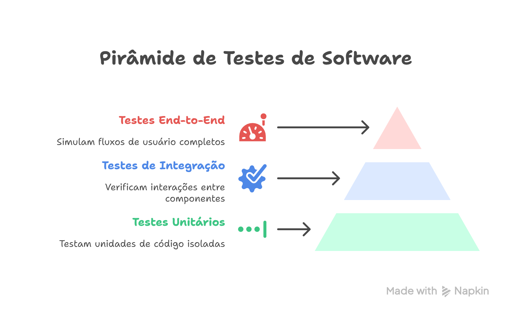
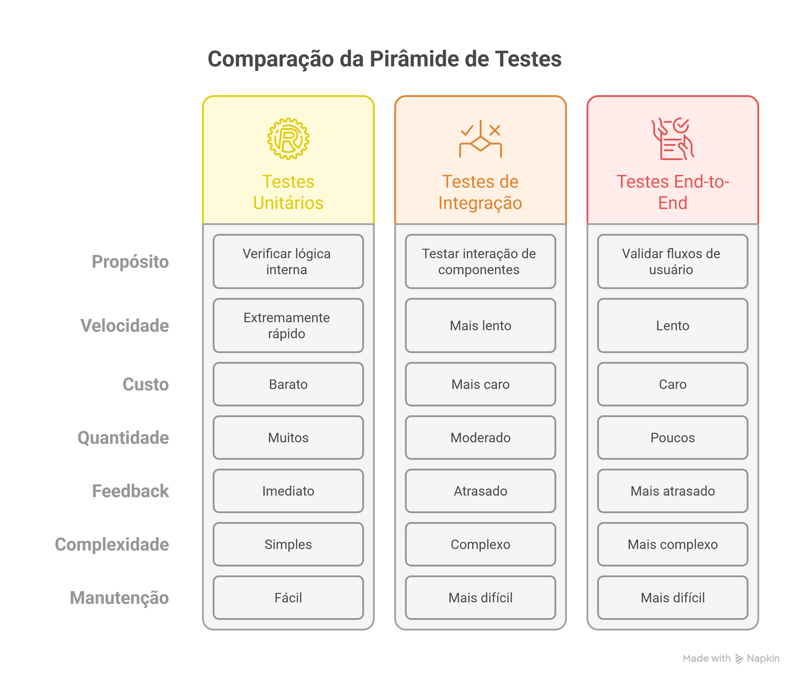

# Day-03 | Garantia de Qualidade — O Coração do CI

---

## 📌 Objetivos de Aprendizado

- Entender por que qualidade é essencial no fluxo de desenvolvimento    
- Compreender a lógica da **pirâmide de testes** e como ela guia a automação    
- Conhecer o conceito de **"fail fast"** e como ele evita desperdícios    
- Reconhecer a importância dos **testes não-funcionais** (performance, segurança, usabilidade) 
- Explorar os **steps de qualidade em um pipeline CI/CD**    
- Desenvolver consciência de que qualidade não é responsabilidade de um papel específico, mas de **todo o time** 

---
## 🏗️ Por que a Qualidade é o Coração do CI?

A **Integração Contínua (CI)** é o motor do desenvolvimento moderno.  
Ela garante que cada mudança no código flua rapidamente para o repositório principal.

Mas pense assim: **não adianta rodar rápido se o combustível é ruim**.  
Se o código que entra no pipeline não tem qualidade, todo o resto da esteira perde o sentido.

💡 **Sem qualidade:**

- Cada commit vira uma loteria    
- Defeitos se acumulam e explodem em fases tardias    
- O time perde confiança no produto    

👉 **Conclusão:** qualidade não é "extra", é parte central do CI.

---
## 🧪 A Pirâmide de Testes

### O que é a Pirâmide de Testes?

A Pirâmide de Testes é um modelo visual que nos ajuda a **equilibrar esforço, custo e eficiência** na hora de testar um software. Ela ilustra a quantidade ideal de cada tipo de teste que devemos ter, guiando-nos para investir nosso tempo e recursos de forma inteligente.

### Entendendo Cada Camada

#### 1. **Base: Testes Unitários (Muitos!)**

São a fundação sólida e ampla da pirâmide. Eles testam as menores unidades de código (funções, métodos ou classes) de forma **completamente isolada** (usando _mocks_ e _stubs_ para dependências externas).

- **Objetivo:** Verificar a lógica interna e o correto funcionamento de cada "tijolo" individual do sistema
    
- **Características:** São **extremamente rápidos** (milissegundos por teste), **baratos** de criar e manter, e fornecem **feedback imediato** aos desenvolvedores. Por isso, devem ser a categoria mais numerosa
    
- **Exemplo:** Testar uma função que calcula imposto, fornecendo diferentes entradas e verificando as saídas esperadas
    

#### 2. **Meio: Testes de Integração (Quantidade Moderada)**

Esses testes verificam a interação e comunicação entre múltiplos "tijolos" ou unidades. Eles garantem que os módulos, quando conectados, funcionam em conjunto conforme o design.

- **Objetivo:** Encontrar defeitos nas interfaces e interações entre componentes integrados (ex.: uma API com seu banco de dados, ou dois microsserviços se comunicando)
    
- **Características:** São **mais lentos** que os unitários, pois envolvem mais partes do sistema. São mais complexos e caros de manter. A quantidade deve ser moderada, focando nas integrações críticas
    
- **Exemplo:** Testar se um endpoint de API, quando chamado, persiste os dados corretamente no banco de dados
    

#### 3. **Topo: Testes End-to-End (E2E) (Poucos!)**

São testes que simulam a jornada completa de um usuário real em um ambiente que espelha a produção. Eles passam por todas as camadas da aplicação, from front-end to back-end.

- **Objetivo:** Validar fluxos de negócio críticos e garantir que todo o sistema, como um conjunto, atende aos requisitos do usuário final
    
- **Características:** São os testes **mais lentos, complexos, frágeis** (quebram com facilidade com pequenas mudanças na UI) e **caros** de desenvolver e executar. Portanto, devem ser poucos e focados nos caminhos felizes (_happy paths_) mais importantes
    
- **Exemplo:** Simular um usuário realizando todo o processo de cadastro, login, adição de um produto ao carrinho e finalização de compra em um e-commerce
    

### 💡 Conclusão: A Regra de Ouro da Pirâmide

A estratégia da pirâmide é clara: **construa uma base larga e estável com muitos testes unitários rápidos**. Esta base suporta uma camada intermediária de testes de integração que validam as conexões. Por fim, coroe o processo com um número reduzido de testes E2E que validam os cenários mais críticos do ponto de vista do usuário. Esta abordagem maximiza a confiabilidade e a velocidade de feedback, minimizando o custo total de testes.

---

### ⚡ Fail Fast: A Filosofia de Corrigir Cedo e Errar Barato

O princípio **"Fail Fast"** (Falhar Rápido) é um pilar cultural e técnico do CI/CD. Ele prega que é melhor descobrir um defeito o mais cedo possível no ciclo de desenvolvimento, preferencialmente segundos após ele ter sido introduzido.

- **A Economia do Erro:** O custo para corrigir um bug encontrado durante a codificação (ou no commit) é orders de magnitude menor do que aquele encontrado em produção. Envolve menos pessoas, menos contexto e menos rollback complexo
    
- **Aplicação no CI:** O pipeline de CI é a materialização deste princípio. Ele é projetado para:
    
    - **Validar commits imediatamente** após o _push_        
    - **Rodar as verificações mais rápidas primeiro** (linting, testes unitários)        
    - **"Barrar" a passagem do código** ao primeiro sinal de problema, impedindo que um defeito prossiga para estágios mais caros e complexos do pipeline
        
- **Benefício:** Cria um ciclo de feedback ultrarrápido para o desenvolvedor, que pode corrigir o problema enquanto o contexto ainda está fresco em sua mente
    

---

### 🛡️ Testes Não-Funcionais: Os Atributos da Qualidade Invisível

A qualidade de um software não é definida apenas pelo que ele faz (requisitos funcionais), mas também **por como ele faz**. Estes são os atributos de qualidade não-funcionais, often conhecidos como os "-ilities":

- **Performance:** Como o sistema se comporta sob carga? Ele é rápido, responsivo e estável? Envolve testes de carga, estresse e volume
    
- **Segurança:** O sistema está protegido contra ameaças e vulnerabilidades? Testes de segurança procuram brechas para invasões, vazamentos de dados e outros riscos
    
- **Usabilidade e Acessibilidade:** A interface é intuitiva e fácil de usar? Ela é acessível para pessoas com deficiência? (Embora often verificada manualmente, existem ferramentas automatizadas para aspectos de acessibilidade)
    
- **Confiabilidade (Reliability):** O sistema opera sem falhas por um período específico?
    
- **Portabilidade:** O sistema pode ser facilmente implantado em diferentes ambientes?
    

Times de alta maturidade **automatizam a verificação** desses atributos sempre que possível, incorporando steps específicos no pipeline (ex.: scan de segurança de código, testes de carga em ambiente de staging) para garantir que a qualidade "invisível" não seja negligenciada.

---

## 🔍 Steps de Qualidade no Pipeline CI/CD

### A Lógica do Pipeline: Uma Corrida de Barreiras Inteligente

Um pipeline de CI/CD eficiente é construído com uma lógica de **otimização de custo e tempo**. Isso significa organizar os estágios de verificação em ordem crescente de complexidade e tempo de execução. Começa-se com as verificações **mais rápidas e baratas**. Se o código falhar em uma etapa inicial, ele é rejeitado imediatamente, poupando recursos computacionais e tempo que seriam gastos executando testes longos em um código que já se provou defeituoso.

A sequência típica e lógica é:

1. **Validação de Sintaxe e Formatação** (Mais Rápido/Barato)    
2. **Análise de Segurança Estática e Dependências**    
3. **Testes Unitários*    
4. **Testes de Integração**    
5. **Testes End-to-End e Não-Funcionais** (Mais Demorado/Caro)
    

---

### ✍️ Commit Linting

- **O que é:** A validação automática da mensage de commit contra um padrão estabelecido (ex.: Conventional Commits)
    
- **Por que fazer:** Mensagens de commit padronizadas geram um histórico de código limpo e legível, facilitam a automação do versionamento semântico e melhoram a comunicação da equipe sobre as mudanças
    
- **Ferramentas:** `Commitlint`, `Husky`    

---

### 🎨 Linting de Código

- **O que é:** A análise estática do código-fonte para强制ar um estilo de codificação consistente e identificar más práticas e erros óbvios
    
- **Por que fazer:** Mantém a codebase uniforme, reduz a "dívida técnica" estética e detecta bugs potenciais antes da execução (ex.: variáveis não declaradas)
    
- **Ferramentas:** `ESLint` (JavaScript), `Checkstyle` (Java), `Pylint` (Python), `RuboCop` (Ruby)
    

---

### 🔒 SAST (Static Application Security Testing)

- **O que é:** A análise do código-fonte (sem executá-lo) para identificar vulnerabilidades de segurança, como injection flaws, cross-site scripting (XSS), e más práticas de codificação que podem levar a brechas
    
- **Por que fazer:** Encontrar e corrigir vulnerabilidades na fase de desenvolvimento, onde o custo de remediação é mais baixo
    
- **Ferramentas:** `SonarQube`, `Semgrep`, `Checkmarx`
    

---

### 📦 SCA (Software Composition Analysis)

- **O que é:** A análise automatizada das dependências e bibliotecas de terceiros usadas no projeto
    
- **Por que fazer:** Identificar se as bibliotecas externas possuem vulnerabilidades de segurança conhecidas (CVEs), são de fontes confiáveis e estão em versões suportadas
    
- **Ferramentas:** `Snyk`, `Dependabot` (GitHub), `WhiteSource`
    

---

### 🐳 Análise de Imagens de Container

- **O que é:** O escaneamento de imagens Docker/OCI em busca de pacotes do sistema operacional e dependências de aplicação que contenham vulnerabilidades
    
- **Por que fazer:** Garantir que la base da sua aplicação em container (a imagem) não introduza riscos de segurança no ambiente de execução
    
- **Ferramenta:** `Trivy`, `Grype`, `Docker Scout`
    

---

### 🔑 Scan de Secrets

- **O que é:** A verificação automática do código-fonte e do histórico de commits para detectar a exposição acidental de credenciais, tokens de API, chaves privadas ou qualquer informação sensível
    
- **Por que fazer:** Prevenir vazamentos de dados e acessos não autorizados que podem levar a violações de segurança graves
    
- **Ferramentas:** `Gitleaks`, `GitGuardian`, `TruffleHog`

---

### 🤖 Testes Automatizados

- **O que é:** A execução automatizada da suíte de testes, seguindo a estratégia da pirâmide
    
- **Ordem de Execução Típica:**
    
    1. **Testes Unitários:** Executados primeiro, são a barreira inicial rápida
        
    2. **Testes de Integração:** Executados em seguida, validam as interações
        
    3. **Testes E2E:** Executados por último, often em um ambiente mais parecido com produção, validam o sistema como um todo
        
- **Por que fazer:** Fornecer confiança contínua de que novas alterações não quebraram funcionalidades existentes (regressão)

---

## 🌱 A Mentalidade de Qualidade: Além do Código e das Ferramentas

Automação, pipelines e ferramentas são fundamentais, mas a **verdadeira transformação em qualidade começa com a mentalidade das pessoas**. Desenvolvedores, engenheiros de DevOps e QA precisam cultivar uma postura específica para construir software excelente de forma sustentável.

### 🤔 **Mudança de Pergunta:**

Não é apenas _"Meu código funciona?"_, mas sim:

- **"Como meu código se comporta em produção?"**    
- **"Ele é fácil de manter e entender por outros membros do time?"**    
- **"Que problemas eu estou prevenindo para o usuário final?"**    
- **"Estou deixando o código mais saudável do que encontrei?"** (Princípio _Boy Scout_)

### 👥 **Empatia pelo Usuário e pelos Colegas:**

- **Pelo usuário:** Entender que cada bug, cada lentidão ou cada mensagem de erro confusa causa **frustração real** em uma pessoa. Você não está codificando para uma máquina, está criando uma experiência para humanos
    
- **Pelos colegas:** Escrever código limpo e bem testado é um ato de respeito com quem vai mantê-lo no futuro (que pode ser você mesmo daqui a 6 meses!). Um pipeline que falha rápido é um alerta útil, não uma punição

### 🌐 **Pensamento Sistêmico: Além do Código-Fonte**

Um software não vive isolado. Ele roda em uma infraestrutura, depende de serviços e é usado por pessoas. Ter uma visão ampla do sistema é crucial:

- **Entenda a Infraestrutura:** Compreender o básico de _onde_ e _como_ a aplicação roda (containers, Kubernetes, servidores) permite tomar decisões mais inteligentes. Um código que consome memória de forma descontrolada, por exemplo, pode derrubar um container em produção. **Na dúvida, converse com o time de Infra/DevOps.** Essa colaboração evita surpresas desagradáveis e resulta em uma aplicação mais estável e performática
    
- **Colabore com o QA:** O tester é seu aliado, não seu adversário. **Converse com o time de QA** para entender cenários de teste complexos, edge cases e o ponto de vista do usuário que você pode não ter considerado. Essa parceria antecipa bugs e fortalece a qualidade do produto
    
- **Foque na Dor Real:** Antes de mergulhar no código, pergunte-se: **"Qual é a dor do usuário que estou resolvendo?"** e **"Qual o problema que a operação (suporte) enfrenta com isso?"**. Entender o contexto real do problema evita que você crie uma solução tecnicamente elegante para a pergunta errada. Software existe para resolver problemas reais
    

### 🔎 **Doneness ≠ Done (Pronto não é igual a Entregue):**

Uma feature não está "pronta" apenas quando funciona no ambiente do desenvolvedor. Ela só está **"Done"** quando:

- ✅ Está com código revisado e seguindo os padrões    
- ✅ Possui testes automatizados adequados    
- ✅ Passou por todas as verificações de segurança e qualidade do pipeline    
- ✅ Está documentada de forma clara    
- ✅ Foi implantada com sucesso em produção (e talvez até monitorada por um tempo)
    

### 🧠 **Cultura de Don't Hate, Automatize! (Não Odeie, Automatize!):**

- Encontrou um processo manual, chato e repetitivo? **Automatize.**    
- A equipe esquece de rodar um teste crítico? **Coloque no pipeline.**    
- Um passo de configuração sempre dá erro? **Torne-o infalível com código (IaC).**    
- Esta mentalidade proativa é o cerne do DevOps e da melhoria contínua    

### 🤝 **Qualidade é Responsabilidade Coletiva:**

- **Não é "o trabalho do QA" achar bugs.** É trabalho do _time_ **não entregar bugs**. O papel do QA é crucial para elaborar estratégias, desafiar o sistema e garantir a qualidade do processo, não ser o único portão de saída
    
- **Não é "o trabalho do DevOps" consertar o pipeline.** É trabalho do _time_ **entender e escrever código que passe pelo pipeline**. Todos devem se sentir donos e contribuir para a eficiência da esteira de CI/CD
    

### 💡 **Conclusão Chave:**

As ferramentas técnicas são o **"braço"** que implementa a qualidade. A mentalidade e as soft skills são o **"cérebro e o coração"** que guiam esse braço. Cultive uma cultura onde a excelência técnica ande de mãos dadas com a colaboração, a empatia, o **pensamento sistêmico** e a melhoria contínua. **Software é, antes de tudo, um produto da colaboração humana.**

---

## ✅ Checklist de Aprendizado

Marque mentalmente se você compreende os seguintes conceitos:

- Compreendo que a qualidade integrada ao CI é o que permite velocidade e confiabilidade verdadeiras    
- Sei explicar a estratégia por trás da Pirâmide de Testes e a razão da proporção entre os tipos de teste    
- Internalizei o princípio de "Fail Fast" e seus benefícios econômicos e técnicos
- Reconheço que testes não-funcionais (performance, segurança) são tão críticos quanto os funcionais    
- Consigo listar e explicar a finalidade dos principais steps de qualidade em um pipeline CI/CD:
    
    - Commit Linting        
    - Linting de Código        
    - SAST        
    - SCA        
    - Scan de Secrets        
    - Análise de Imagens de Container        
    - Execução de Testes (Unit, Integration, E2E)
        
- Tenho clareza de que a qualidade é uma responsabilidade compartilhada por **todos os membros do time** que escrevem código, e não apenas de testadores/QA
    
---
# 🔗 Recursos de Apoio

| Recurso | Descrição | Link |
|---------|-----------|------|
| **Artigo da Pirâmide de Testes** | Artigo original por Martin Fowler (inglês) | [martinfowler.com](https://martinfowler.com/articles/practical-test-pyramid.html) |
| **SAST - Red Hat** | Explicação sobre Static Application Security Testing | [redhat.com](https://www.redhat.com/pt-br/topics/security/what-is-sast) |
| **SonarQube** | Documentação oficial da ferramenta de qualidade de código | [sonarqube.org](https://www.sonarqube.org/) |
| **ESLint** | Documentação do linter para JavaScript/TypeScript | [eslint.org](https://eslint.org/) |
| **Trivy** | Documentação do scanner de segurança | [aquasecurity.github.io](https://aquasecurity.github.io/trivy/) |
| **Gitleaks** | Repositório oficial do detector de segredos | [github.com/gitleaks](https://github.com/gitleaks/gitleaks) |
| **GitGuardian** | Site oficial da plataforma de segurança | [gitguardian.com](https://www.gitguardian.com/) |
---

> **🏠 Voltar ao Índice:** [Índice do Curso](../course)  
> **⬅️ Anterior:** [Day-02 - Fundamentos do Git e Versionamento](./Day-02/02.md)  
> **➡️ Próximo:** [Day-04 - Introdução a Ferramentas de CI](../Day-04/04.md)