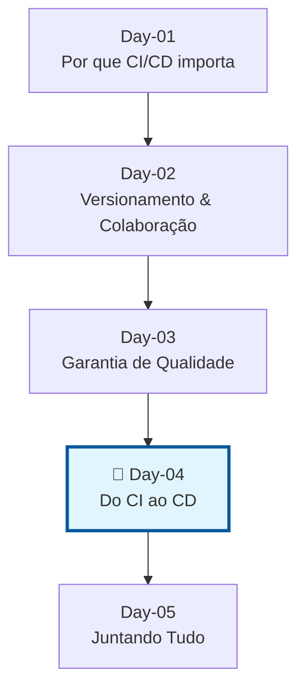
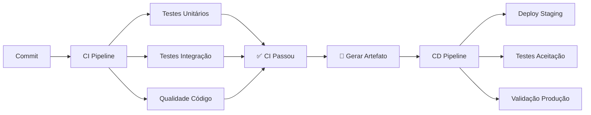
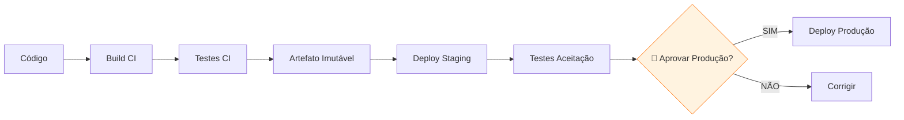
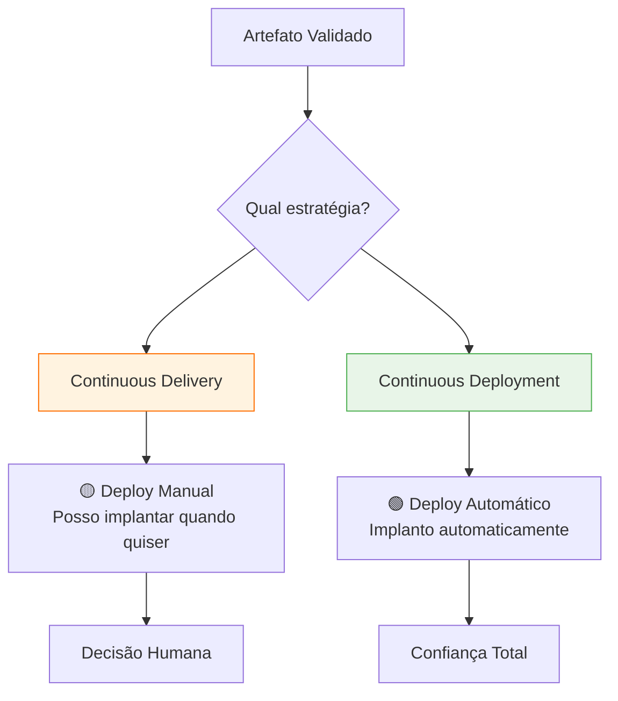
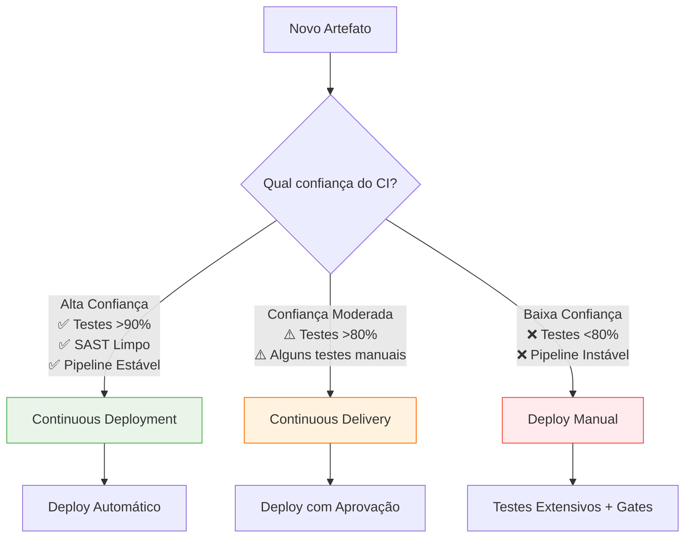
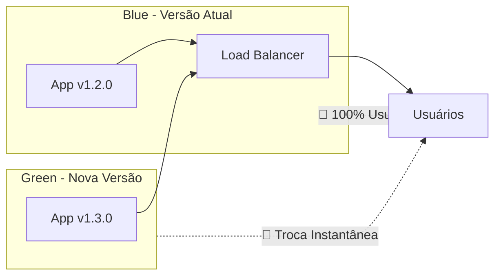
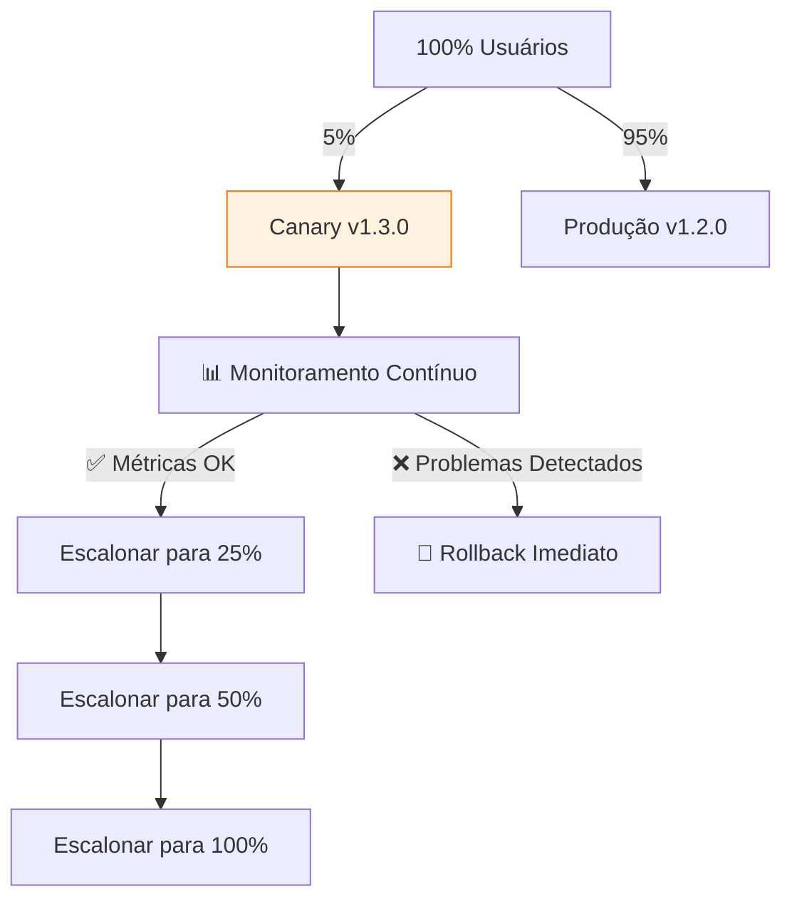
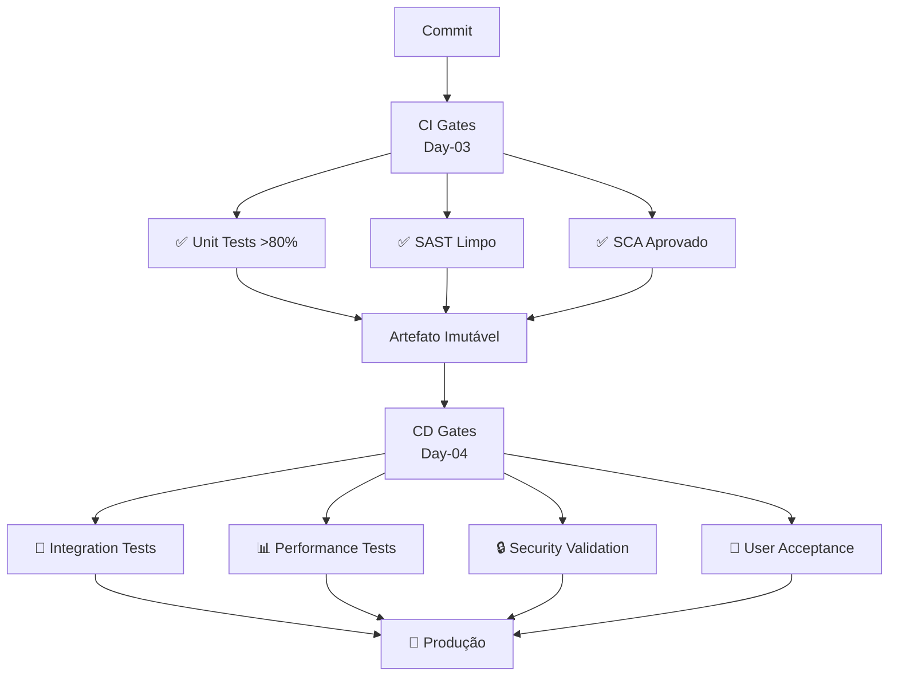
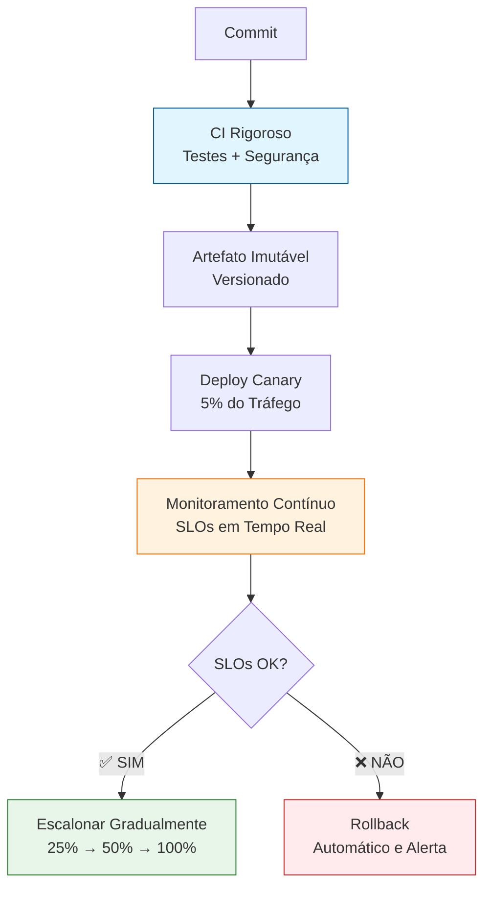
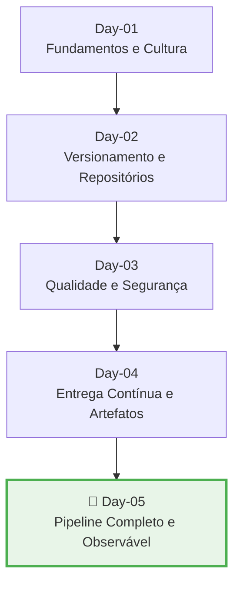

# Day-04 | Do CI ao CD - Artefatos, Entrega e Deploy Contínuo

## 📌 Objetivos de Aprendizado 

- 🔗 Conectar **qualidade do CI** com **entrega do CD**
- 📦 Implementar **artefatos imutáveis** como resultado do pipeline
- 🚀 Distinguir **Continuous Delivery** vs **Continuous Deployment**
- 🎯 Escolher estratégias de deploy baseadas em **risco e confiança**
- 🛡️ Projetar **gates de qualidade** que evoluem do CI para o CD
- 📊 Analisar casos reais aplicando conceitos dos dias anteriores

---

## 🔗 Ponte CI → CD: A Qualidade como Fundação

### 🎯 Relembrando Nossa Jornada

**Onde estamos e como chegamos aqui:**



### 🔄 Do "Código Funciona" para "Código Entrega"

**No Day-03** vimos sobre **qualidade de código**.  
**No Day-04** vamos aprender como garantir que **o código entrega valor**.



---

## 🧩 Artefatos: O "Produto Final" do CI

### 📦 O que São Artefatos e Por que Importam?

Pensa nos artefatos como o resultado final do seu trabalho — aquilo que sai do outro lado do pipeline de CI.
É o seu código transformado em algo que pode ser realmente usado, testado e entregue.

**Analogia:** Se o código-fonte é a receita, o artefato é o **bolo embalado e testado** pronto pra ser servido!.

### 🏗️ Conectando com Conceitos Anteriores

**Lembra do Day-02?**

Agora o versionamento semântico começa a mostrar seu valor.

Com ele, conseguimos identificar exatamente qual versão e qual commit gerou aquele artefato:

```bash
# Versionamento que conecta CI com CD
ARTIFACT_VERSION="1.4.3+$(git rev-parse --short HEAD)"
# Resultado: 1.4.3+a1b2c3d4
# Agora sabemos EXATAMENTE qual commit está onde!
```

**E do Day-03?**

Toda a parte de qualidade entra aqui — testes, padrões, segurança... tudo isso garante que o artefato final seja confiável.

```yaml
# Pipeline evolutivo - conectando todos os conceitos
stages:
  - lint           # 👈 Day-02: Padrão de Commit
  - test           # 👈 Day-03: Pirâmide de Testes  
  - security_scan  # 👈 Day-03: SAST/SCA
  - build          # 🎯 Day-04: Gera o Artefato
  - deploy_staging # 🎯 Day-04: CD - Entrega
  - deploy_prod    # 🎯 Day-04: CD - Implantação
```

### 🔒 O Princípio da Imutabilidade na Prática

**Problema comum:**
```bash
# ❌ "Funciona na minha máquina" vira "Quebrou em produção"
# Build Segunda: app-v1.0.0.jar
# Build Terça:   app-v1.0.0.jar (MAS DIFERENTE!)
```

O que acontece aqui é que o artefato muda de um dia pro outro — e isso é receita pra dor de cabeça.

A solução? **Artefatos imutáveis:**

```bash
# ✅ Mesmo artefato, todos os ambientes
app-v1.0.0+a1b2c3d4.jar → Homologação ✅
app-v1.0.0+a1b2c3d4.jar → Produção ✅
# Exatamente o mesmo arquivo!
```

Quando o artefato não muda, você sabe que o que testou é exatamente o que está rodando.

### 🛠️ Hands-On: Criando seu Primeiro Artefato Imutável

Exemplo simples usando Docker com metadados:

```dockerfile
FROM openjdk:11-jre-slim

# Metadados de rastreabilidade (Day-02 + Day-04)
LABEL version="1.4.3+a1b2c3d4" \
      build_timestamp="2024-01-15T10:30:00Z" \
      commit_hash="a1b2c3d4" \
      tests_passed="true" \
      security_scan="clean"

COPY app.jar /app/app.jar

# Checksum para verificação de integridade
RUN sha256sum /app/app.jar > /app/app.jar.sha256

CMD ["java", "-jar", "/app/app.jar"]
```

Antes de enviar pra produção, dá pra conferir se o arquivo está 100% íntegro:

```bash
# No pipeline de CD - validando integridade
sha256sum -c app.jar.sha256
# ✅ app.jar: OK - Pronto para deploy!
```

---

## ⚙️ Da Integração à Entrega: A Evolução do Pipeline

### 🔁 Continuous Delivery (CD): "Sempre Pronto para Entregar"

Pensa no Continuous Delivery (CD) como o próximo passo natural depois do CI.

👉 Enquanto o CI garante que “o código funciona”,
o CD garante que “o código está pronto para ser entregue a qualquer momento”.

É aqui que todo o trabalho dos dias anteriores se conecta:
- ✅ **Day-02**: Versionamento semântico → sabemos exatamente o que estamos entregando.
- ✅ **Day-03**: Testes automatizados → confiamos que o que entregamos funciona.  
- 🎯 **Day-04**: Artefatos imutáveis → entregamos exatamente o que foi testado.

Em outras palavras: o CD é aquele momento em que o time pode dizer com segurança — “se quiser, podemos colocar isso em produção agora.”


**Fluxo do Continuous Delivery:**


Esse fluxo mostra bem o espírito do CD: tudo automatizado até o ponto da decisão final.
Quem dá o “OK” para produção ainda é um humano — o sistema só espera a confirmação.

### ⚡ Continuous Deployment: "Entregando Automaticamente"

Agora, o Continuous Deployment (também CD) é como levar o Continuous Delivery um passo além.

Aqui, nem precisa de aprovação manual:
passou nos testes → vai pra produção automaticamente.
Simples assim.

A diferença entre eles fica clara assim:



O Continuous Delivery é como ter o carro ligado, pronto pra sair.

O Continuous Deployment é colocar o carro no piloto automático — ele vai sozinho, porque você confia 100% no sistema.

### 🎯 Quando Escolher Cada Abordagem?

Tudo se resume a nível de confiança no seu pipeline e nos testes.

Pense assim:


Resumindo:

. Se seu pipeline é maduro e confiável, vá de Continuous Deployment.

. Se ainda precisa de uma validação humana, Continuous Delivery é o caminho.

. E se o pipeline ainda é instável, nada de pressa — deploy manual é mais seguro.


---

## 🚀 Estratégias de Deploy: Engenharia de Confiabilidade

### 🌈 Blue-Green Deployment: Troca Segura

Depois que o código está pronto pra ser entregue, vem a grande pergunta:

👉 Como colocar isso em produção sem quebrar nada?

É aí que entram as **estratégias de deploy** — formas inteligentes de publicar novas versões com **segurança, controle e confiança**.


Quando tudo estiver testado e funcionando no ambiente Green, basta mudar o tráfego do load balancer — e pronto! Todos os usuários passam a usar a nova versão sem nenhum downtime.

Se algo der errado, é só redirecionar o tráfego de volta pra Blue. Rollback instantâneo. 🚀

**Por que é tão bom?**

✅ **Zero downtime:** ninguém percebe a troca.

✅ **Rollback rápido:** se algo falhar, volta em segundos.

✅ **Teste em produção:** dá pra validar a versão nova antes de liberar geral.

### 🐦 Canary Releases: Liberação Inteligente

**Quando usar:** quando você quer liberar algo novo aos poucos, reduzindo o risco.

Aqui, a ideia é lançar a nova versão (o “canário”) **apenas pra uma pequena parcela dos usuários** tipo 5% e monitorar o comportamento antes de liberar pra todo mundo.



Durante esse processo, você acompanha as métricas em tempo real.
Se tudo estiver dentro do esperado, aumenta gradualmente a porcentagem de usuários.
Mas se algo sair do controle — rollback na hora.

O que monitorar (ligando com o Day-03):

```yaml
canary_metrics:
  error_rate:     "< 0.1%"    # 👈 Lembra dos testes automatizados?
  latency_p95:    "< 500ms"   # 👈 Performance que validamos no CI
  throughput:     "> 1000rpm" # 👈 Capacidade do sistema
  business_metrics:           # 👈 Métricas de negócio
    - conversion_rate
    - user_satisfaction
```

Essas métricas garantem que o sistema continua saudável, e que o que está indo pro ar realmente entrega valor.

🎯 Como Escolher a Estratégia Certa?

Não existe bala de prata tudo depende do nível de risco e do tipo de mudança que você vai fazer.
Aqui vai um guia prático:


|Cenário|Estratégia Recomendada|Por quê?|
|---|---|---|
|💳 Aplicação crítica (banco, saúde, etc.)|	Blue-Green|	Rollback instantâneo pode evitar prejuízos sérios|
|🧪 Feature nova e arriscada|	Canary Release|	Permite testar aos poucos e limitar o impacto|
|🐞 Bug fix simples|	Rolling Update|	Atualização rápida e eficiente|
|🧱 Mudança de infraestrutura|	Blue-Green|	Isolamento total dos ambientes traz segurança extra|

👉 Resumindo:

* *Blue-Green é pra quem precisa de zero downtime e rollback instantâneo.

* *Canary é pra quem quer reduzir risco e observar o impacto real antes de liberar pra todos.

* E o segredo de tudo isso? Monitoramento e confiança no pipeline.

---

## 🛂 Gates de Qualidade: Evoluindo do CI para o CD

### 🔄 Do Desenvolvimento para Produção

Chegamos ao ponto em que qualidade não é mais só um “check” no CI — ela agora controla o fluxo da entrega.
Esses são os famosos “gates de qualidade”: barreiras inteligentes que só deixam o código seguir se ele realmente estiver pronto.

Pensa assim: cada gate é como uma catraca que só gira quando todos os critérios de qualidade foram cumpridos.
Se algo falha, o pipeline simplesmente não avança — e isso é ótimo, porque evita levar problema pra produção. 🚧



👉 Ou seja: o que começa com testes unitários, lint e segurança no CI, evolui para testes de integração, performance, segurança e aceitação no CD.
Tudo isso garante que cada etapa só avança se estiver realmente validada.

### 📊 Critérios de Promoção Entre Ambientes

Cada ambiente (CI → Staging → Produção) precisa provar que está pronto antes de receber a próxima etapa.

Esses critérios são como “regras de promoção” dentro do pipeline:

| **Gate** | **Critérios (Day-03)** | **Ferramentas** | **CD Evolution** |
|----------|----------------|-----------------|------------------|
| **CI** | Cobertura >80%<br/>SAST limpo | Jest, SonarQube | ✅ Foundation |
| **Staging** | Performance p95 <1s<br/>SCA aprovado | Lighthouse, OWASP | 🚀 Pre-Prod Validation |
| **Production** | Canary metrics estáveis<br/>SLOs atendidos | Prometheus, Grafana | 🎯 Live Monitoring |

💡 Perceba como os critérios evoluem:
no início testamos o código, depois testamos o sistema inteiro, e por fim, monitoramos o comportamento em produção.

É um ciclo completo de confiança.

### 🛡️ Exemplo: Pipeline de Gates Progressivos

Pra visualizar tudo isso na prática, aqui vai um exemplo de pipeline completo com gates desde o CI até o CD:

```yaml
# .gitlab-ci.yml - Pipeline completo
stages:
  - quality     # Day-03
  - build       # Day-04  
  - deployment  # Day-04

quality_checks:
  stage: quality
  script:
    - npm run test:coverage    # 👈 Day-03
    - npm run lint             # 👈 Day-03
    - npm run security:scan    # 👈 Day-03
  rules:
    - if: $CI_COMMIT_BRANCH == "main"

build_artifact:
  stage: build
  script:
    - docker build -t app:$CI_COMMIT_SHA .
    - echo "$CI_COMMIT_SHA" > version.txt
  needs: ["quality_checks"]

deploy_staging:
  stage: deployment
  script:
    - kubectl apply -f k8s/staging/
    - ./scripts/wait-for-healthy.sh
  needs: ["build_artifact"]
  
deploy_production:
  stage: deployment
  script:
    - kubectl apply -f k8s/production/
  rules:
    - if: $CI_COMMIT_TAG  # 👈 Deploy manual para produção
  needs: ["deploy_staging"]
```

💬 Repara como cada etapa depende da anterior — o código só é construído se passar nos testes, e só é implantado se tudo estiver saudável.
É isso que transforma o pipeline em uma verdadeira linha de produção de confiança.

👉 Em resumo:
Os gates de qualidade são o elo entre o “funciona na minha máquina” e o “funciona em produção”.
Eles trazem disciplina, visibilidade e segurança — e fazem a diferença entre entregar código e entregar software confiável.


---

## 🧠 Caso Real: NHS - Análise com Nossa Stack de Aprendizado

### 📋 O Contexto

Em 2023, o NHS (National Health Service), sistema público de saúde britânico, enfrentou uma falha crítica em seu ambiente de produção.
Diversos sistemas ficaram indisponíveis por horas, afetando atendimentos e registros médicos.

Vamos reinterpretar esse cenário com o que aprendemos até o Day-04.

Analisando com nossa lente DevOps:
```bash
# ❌ FALHAS IDENTIFICADAS:
# Day-02: Versionamento semântico inconsistente
# Day-03: Testes de integração insuficientes  
# Day-04: Artefatos não-imutáveis + deploy manual
# Day-04: Monitoramento proativo insuficiente
```

Esses problemas criaram um efeito cascata:

* Releases diferentes foram implantadas com versões ambíguas.
* Faltava automação de validação antes de subir à produção.
* O deploy era feito manualmente — abrindo margem para erros humanos.
* Não havia observabilidade contínua, dificultando a detecção precoce de falhas.

🧩 Solução Aplicando Nossa Stack de Aprendizado

Reestruturando o pipeline com base nos conceitos dos Days 02 a 04, temos:

```bash
# ✅ SOLUÇÃO IMPLEMENTADA:

# 1. Day-02: Versionamento confiável e rastreável
VERSION="2.1.0+$(git rev-parse --short HEAD)"

# 2. Day-03: Pipeline de qualidade robusto
# - Testes unitários: 85% cobertura
# - Testes de integração automatizados
# - SAST: 0 vulnerabilidades críticas  
# - SCA: dependências auditadas e atualizadas

# 3. Day-04: CD com artefatos imutáveis e deploy seguro
# - Artefato: app-${VERSION}.jar (checksum validado)
# - Estratégia: Canary Release com métricas em tempo real
# - Rollback: Automático se SLOs violados
```

💡 Resultado: o pipeline passou a ser previsível, rastreável e resiliente.

Cada versão é testada, validada e monitorada antes de chegar ao público final.

### 🛠️ Plano de Ação NHS Corrigido



Esse fluxo representa o ciclo de maturidade do CD:

1. Confiança no código (CI).
2. Artefato validado e imutável.
3. Entrega gradual e observável.
4. Automação na decisão de avanço ou rollback.

---

## 🎯 Preparação para o Day-05: Juntando Tudo

### 🧩 Nossa Linha do Tempo da Maturidade DevOps



A partir do Day-05, você aprenderá a orquestrar tudo isso em uma pipeline única, integrando:

* CI + CD automatizados,
* Gates de qualidade dinâmicos,
* Deploy seguro, e
* Observabilidade ativa.

### ✅ Checklist de Aprendizado Day-04

- [x] Compreendo como **artefatos imutáveis** conectam CI com CD
- [x] Sei diferenciar **Continuous Delivery** vs **Continuous Deployment**
- [x] Consigo escolher entre **Blue-Green** e **Canary** deployments
- [x] Entendo como **gates de qualidade** evoluem do CI para o CD
- [x] Reconheço a importância do **monitoramento** no deployment contínuo
- [x] Consigo aplicar **versionamento semântico** em artefatos
- [x] Compreendo a **progressão lógica** entre todos os dias do curso

---

## 🔗 Recursos de Apoio

| Tipo | Link | Destaque |
|------|------|----------|
| 📚 Livro | Continuous Delivery - Jez Humble | Fundamentos teóricos |
| 🛠️ Playbook | [Kubernetes Deployment Strategies](https://k8s-deployments.com/) | Exemplos práticos |
| 🎥 Vídeo | [Google Cloud - CD vs CD Explained](https://www.youtube.com/watch?v=5y7d6Y2a4b4) | Visualização clara |
| 🔧 Ferramenta | [Trivy - Container Security](https://aquasecurity.github.io/trivy/) | Segurança em artefatos |

---

> **💡 Dica Final:** CI/CD é sobre confiança.
>
> Cada teste, cada commit organizado, cada artefato versionado é um passo nessa direção. Amanhã vamos ver tudo funcionando junto! 🏠✨

---

> **🏠 Voltar ao Índice:** [Índice do Curso](home.html)  
> **⬅️ Anterior:** [Day-03 | Garantia de Qualidade — O Coração do CI](03.html)  
> **➡️ Próximo:** [Day-05: Juntando Tudo - Da Teoria à Excelência](05.html)
