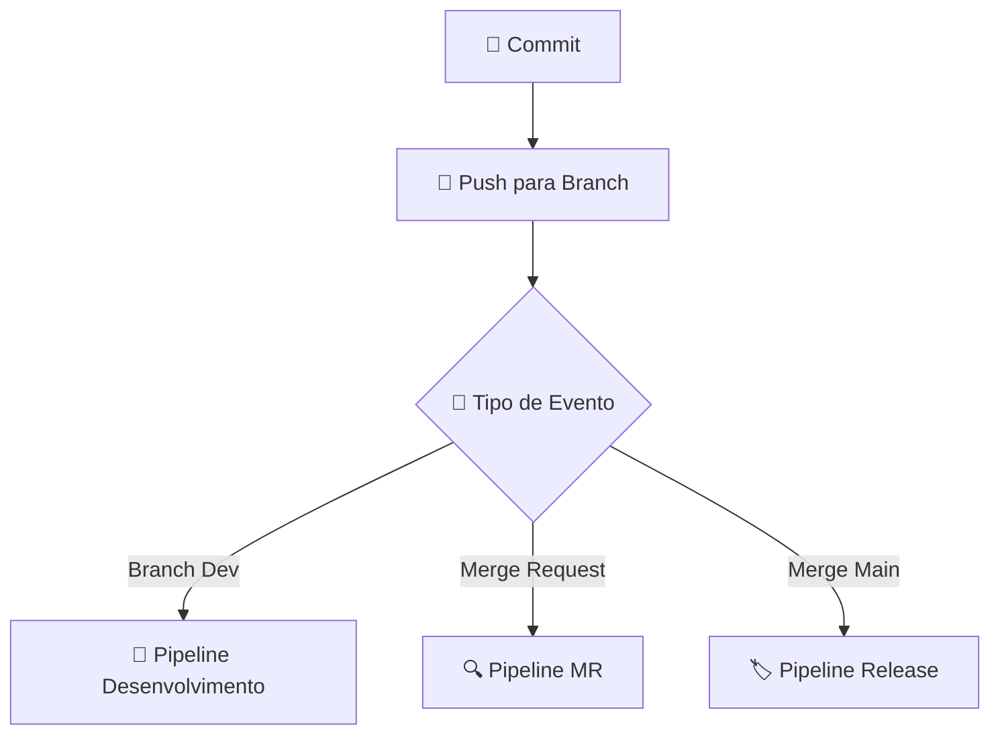
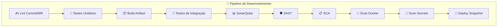
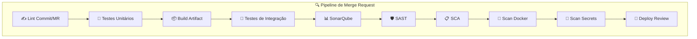
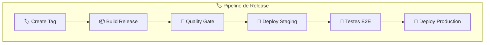
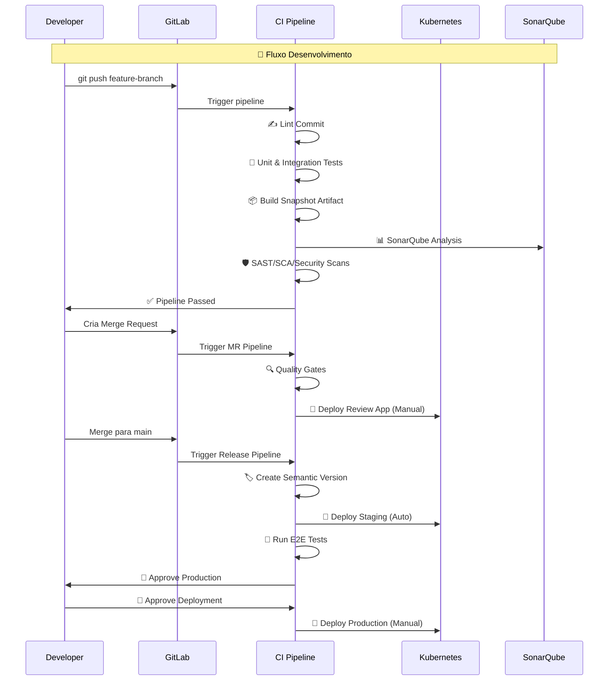

# Day-05 | Construindo Pipelines CI/CD - Do Conceito à Prática

---

## 📌 O que você vai aprender hoje

Ao final deste dia, você vai conseguir:

- Entender cada parte de um pipeline CI/CD
- Saber quando usar testes, builds, scans e deploys
- Aprender a acelerar seus pipelines com cache
- Criar templates para reaproveitar configurações
- Construir pipelines do simples ao avançado
- Aplicar boas práticas do mundo real

---

# 🧩 Pipeline CI/CD Java - Fluxo Completo com Qualidade

Vamos implementar um pipeline robusto para aplicação Java com todas as etapas de qualidade que você mencionou.

Perfeito 👌 — o seu diagrama está excelente, mas realmente muito denso para visualização.
A melhor forma de dividir é separar **por nível de pipeline** (Dev, MR e Release) e manter um diagrama inicial simples que mostra o fluxo geral.

Aqui vai uma sugestão didática de **4 blocos Mermaid**, mantendo a clareza visual e a progressão lógica:

---

### 🧩 1. Fluxo Geral — Do Commit ao Tipo de Pipeline



---

### 💻 2. Pipeline de Desenvolvimento (Branch Dev)



---

### 🧪 3. Pipeline de Merge Request (Validação de Qualidade)



---

### 🚀 4. Pipeline de Release (Entrega e Produção)



## 🐳 **Imagem Customizada OpenJDK**

Vamos usar uma imagem customizada com todas as ferramentas necessárias:

**Dockerfile.ci**
```dockerfile
FROM openjdk:17-jdk-slim

# Instalações básicas
RUN apt-get update && apt-get install -y \
    curl \
    gnupg \
    git \
    python3 \
    python3-pip \
    && rm -rf /var/lib/apt/lists/*

# Instala Maven
ARG MAVEN_VERSION=3.9.6
RUN curl -fsSL https://archive.apache.org/dist/maven/maven-3/${MAVEN_VERSION}/binaries/apache-maven-${MAVEN_VERSION}-bin.tar.gz | \
    tar -xzf - -C /opt && \
    ln -s /opt/apache-maven-${MAVEN_VERSION} /opt/maven && \
    ln -s /opt/maven/bin/mvn /usr/bin/mvn

# Instala Node.js para commitlint
RUN curl -fsSL https://deb.nodesource.com/setup_18.x | bash - && \
    apt-get install -y nodejs

# Instala ferramentas de segurança
RUN curl -sfL https://raw.githubusercontent.com/anchore/grype/main/install.sh | sh -s -- -b /usr/local/bin && \
    curl -sfL https://raw.githubusercontent.com/anchore/syft/main/install.sh | sh -s -- -b /usr/local/bin

# Instala gitleaks
RUN curl -sfL https://github.com/gitleaks/gitleaks/releases/latest/download/gitleaks_$(uname -s)_$(uname -m).tar.gz | \
    tar -xzf - -C /usr/local/bin

# Instala trivy
RUN curl -sfL https://raw.githubusercontent.com/aquasecurity/trivy/main/contrib/install.sh | sh -s -- -b /usr/local/bin

# Configura environment
ENV JAVA_HOME=/usr/local/openjdk-17
ENV M2_HOME=/opt/maven
ENV PATH="$M2_HOME/bin:$PATH"

WORKDIR /workspace
```

## 🔧 **Pipeline Principal (.gitlab-ci.yml)**

```yaml
image: registry.company.com/ci/java-maven:latest

variables:
  MAVEN_OPTS: "-Dmaven.repo.local=.m2/repository -Dorg.slf4j.simpleLogger.log.org.apache.maven.cli.transfer.Slf4jMavenTransferListener=WARN"
  MAVEN_CLI_OPTS: "--batch-mode --errors --fail-at-end --show-version"

stages:
  - validation
  - test
  - build
  - quality
  - deployment
  - release

# Cache para melhor performance
cache:
  key: "${CI_COMMIT_REF_SLUG}"
  paths:
    - .m2/repository
    - target/
```

## ✍️ **Validação Inicial**

```yaml
lint_commits:
  stage: validation
  image: node:18-alpine
  before_script:
    - npm install -g @commitlint/cli @commitlint/config-conventional
  script:
    - |
      cat << EOF > .commitlintrc.json
      {
        "extends": ["@commitlint/config-conventional"],
        "rules": {
          "type-enum": [2, "always", [
            "feat", "fix", "docs", "style", "refactor",
            "test", "chore", "perf", "ci", "build", "revert"
          ]],
          "scope-enum": [2, "always", [
            "controller", "service", "repository", "model",
            "config", "security", "test", "deps", "maven", "api"
          ]]
        }
      }
      EOF
    - echo "$CI_COMMIT_MESSAGE" | npx commitlint
  rules:
    - if: $CI_COMMIT_TAG
      when: never
    - if: $CI_COMMIT_BRANCH

lint_mr_title:
  stage: validation
  image: node:18-alpine
  before_script:
    - npm install -g @commitlint/cli @commitlint/config-conventional
  script:
    - echo "$CI_MERGE_REQUEST_TITLE" | npx commitlint
  rules:
    - if: $CI_MERGE_REQUEST_IID
```

## 🧪 **Testes**

```yaml
unit_tests:
  stage: test
  script:
    - mvn $MAVEN_CLI_OPTS clean test
    - mvn $MAVEN_CLI_OPTS jacoco:report
  artifacts:
    paths:
      - target/site/jacoco/
    reports:
      junit:
        - target/surefire-reports/*.xml
    expire_in: 1 week
  coverage: '/Total.*?([0-9]{1,3})%/'
  rules:
    - if: $CI_COMMIT_BRANCH

integration_tests:
  stage: test
  script:
    - mvn $MAVEN_CLI_OPTS verify -DskipUnitTests
    - mvn $MAVEN_CLI_OPTS failsafe:report
  artifacts:
    paths:
      - target/site/failsafe-reports/
    reports:
      junit:
        - target/failsafe-reports/*.xml
    expire_in: 1 week
  rules:
    - if: $CI_COMMIT_BRANCH
```

## 📦 **Build**

```yaml
build_artifact:
  stage: build
  script:
    - mvn $MAVEN_CLI_OPTS clean package -DskipTests
    - |
      if [[ "$CI_COMMIT_BRANCH" == "$CI_DEFAULT_BRANCH" ]]; then
        mvn $MAVEN_CLI_OPTS versions:set -DnewVersion=${CI_COMMIT_TAG:-$CI_COMMIT_SHORT_SHA}
      else
        mvn $MAVEN_CLI_OPTS versions:set -DnewVersion=${CI_COMMIT_SHORT_SHA}-SNAPSHOT
      fi
  artifacts:
    paths:
      - target/*.jar
      - target/*.war
    expire_in: 1 week
  rules:
    - if: $CI_COMMIT_BRANCH

build_docker:
  stage: build
  image: docker:24
  services:
    - docker:24-dind
  script:
    - |
      if [[ "$CI_COMMIT_BRANCH" == "$CI_DEFAULT_BRANCH" && -n "$CI_COMMIT_TAG" ]]; then
        export IMAGE_TAG=$CI_COMMIT_TAG
      else
        export IMAGE_TAG=$CI_COMMIT_SHORT_SHA-SNAPSHOT
      fi
    - docker build -t $CI_REGISTRY_IMAGE:$IMAGE_TAG .
    - docker push $CI_REGISTRY_IMAGE:$IMAGE_TAG
  rules:
    - if: $CI_COMMIT_BRANCH
```

## 🛡️ **Qualidade - Security & SAST**

```yaml
code_quality:
  stage: quality
  script:
    - mvn $MAVEN_CLI_OPTS sonar:sonar 
        -Dsonar.projectKey=my-java-app 
        -Dsonar.host.url=$SONAR_HOST_URL 
        -Dsonar.login=$SONAR_TOKEN
        -Dsonar.coverage.jacoco.xmlReportPaths=target/site/jacoco/jacoco.xml
  rules:
    - if: $CI_COMMIT_BRANCH

sast_analysis:
  stage: quality
  script:
    - mvn $MAVEN_CLI_OPTS org.owasp:dependency-check-maven:check
    - mvn $MAVEN_CLI_OPTS pmd:check
    - mvn $MAVEN_CLI_OPTS spotless:check
    - mvn $MAVEN_CLI_OPTS checkstyle:check
  artifacts:
    paths:
      - target/dependency-check-report.html
      - target/pmd.xml
      - target/checkstyle-result.xml
    expire_in: 1 week
  rules:
    - if: $CI_COMMIT_BRANCH

sca_analysis:
  stage: quality
  script:
    - mvn $MAVEN_CLI_OPTS versions:display-dependency-updates
    - mvn $MAVEN_CLI_OPTS org.owasp:dependency-check-maven:aggregate
  artifacts:
    reports:
      dependency_scanning:
        - target/dependency-check-report.json
  rules:
    - if: $CI_COMMIT_BRANCH

docker_scan:
  stage: quality
  script:
    - |
      if [[ "$CI_COMMIT_BRANCH" == "$CI_DEFAULT_BRANCH" && -n "$CI_COMMIT_TAG" ]]; then
        export IMAGE_TAG=$CI_COMMIT_TAG
      else
        export IMAGE_TAG=$CI_COMMIT_SHORT_SHA-SNAPSHOT
      fi
    - trivy image --exit-code 1 --severity HIGH,CRITICAL $CI_REGISTRY_IMAGE:$IMAGE_TAG
    - trivy image --format template --template "@contrib/html.tpl" -o gl-dependency-scanning-report.html $CI_REGISTRY_IMAGE:$IMAGE_TAG
  artifacts:
    reports:
      container_scanning:
        - gl-dependency-scanning-report.html
  rules:
    - if: $CI_COMMIT_BRANCH

secret_scan:
  stage: quality
  script:
    - gitleaks detect --source . --verbose --redact
  rules:
    - if: $CI_COMMIT_BRANCH
```

## 🚀 **Deploy por Ambiente**

```yaml
deploy_dev_snapshot:
  stage: deployment
  image: bitnami/kubectl:latest
  script:
    - |
      if [[ "$CI_COMMIT_BRANCH" != "$CI_DEFAULT_BRANCH" ]]; then
        echo "Deploying SNAPSHOT version to Dev"
        kubectl set image deployment/myapp myapp=$CI_REGISTRY_IMAGE:$CI_COMMIT_SHORT_SHA-SNAPSHOT -n dev
        kubectl rollout status deployment/myapp -n dev --timeout=300s
      fi
  environment:
    name: dev
    url: https://dev.myapp.com
  when: manual
  rules:
    - if: $CI_COMMIT_BRANCH && $CI_COMMIT_BRANCH != $CI_DEFAULT_BRANCH

deploy_qa_review:
  stage: deployment
  image: bitnami/kubectl:latest
  script:
    - echo "Deploying MR version to QA for review"
    - kubectl set image deployment/myapp-review-$CI_MERGE_REQUEST_IID myapp=$CI_REGISTRY_IMAGE:$CI_COMMIT_SHORT_SHA-SNAPSHOT -n qa
    - kubectl rollout status deployment/myapp-review-$CI_MERGE_REQUEST_IID -n qa --timeout=300s
  environment:
    name: qa/review
    url: https://review-${CI_MERGE_REQUEST_IID}.qa.myapp.com
    on_stop: stop_qa_review
  when: manual
  rules:
    - if: $CI_MERGE_REQUEST_IID

stop_qa_review:
  stage: deployment
  image: bitnami/kubectl:latest
  script:
    - kubectl delete deployment/myapp-review-$CI_MERGE_REQUEST_IID -n qa
  when: manual
  environment:
    name: qa/review
    action: stop
  rules:
    - if: $CI_MERGE_REQUEST_IID
```

## 🏷️ **Release & Production**

```yaml
create_release:
  stage: release
  image: registry.company.com/ci/java-maven:latest
  before_script:
    - git config --global user.email "ci@company.com"
    - git config --global user.name "CI/CD Bot"
  script:
    - |
      # Analisa commits para determinar versionamento
      LATEST_TAG=$(git describe --tags --abbrev=0 2>/dev/null || echo "v0.0.0")
      echo "Latest tag: $LATEST_TAG"
      
      # Determina próximo version baseado nos commits desde último tag
      if git log --oneline $LATEST_TAG..HEAD | grep -q "feat:"; then
        BUMP="minor"
      elif git log --oneline $LATEST_TAG..HEAD | grep -q "fix:"; then
        BUMP="patch"
      else
        BUMP="patch"
      fi
      
      # Calcula nova versão
      VERSION=$(echo $LATEST_TAG | sed 's/^v//')
      MAJOR=$(echo $VERSION | cut -d. -f1)
      MINOR=$(echo $VERSION | cut -d. -f2)
      PATCH=$(echo $VERSION | cut -d. -f3)
      
      case $BUMP in
        "major") NEW_VERSION="v$((MAJOR+1)).0.0" ;;
        "minor") NEW_VERSION="v$MAJOR.$((MINOR+1)).0" ;;
        "patch") NEW_VERSION="v$MAJOR.$MINOR.$((PATCH+1))" ;;
      esac
      
      echo "New version: $NEW_VERSION"
      
      # Cria tag e release
      git tag -a $NEW_VERSION -m "Release $NEW_VERSION"
      git push origin $NEW_VERSION
      
      # Atualiza POM com nova versão
      mvn versions:set -DnewVersion=$NEW_VERSION -DgenerateBackupPups=false
  rules:
    - if: $CI_COMMIT_BRANCH == $CI_DEFAULT_BRANCH
      when: manual

deploy_staging:
  stage: deployment
  image: bitnami/kubectl:latest
  script:
    - echo "Deploying release $CI_COMMIT_TAG to Staging"
    - kubectl set image deployment/myapp myapp=$CI_REGISTRY_IMAGE:$CI_COMMIT_TAG -n staging
    - kubectl rollout status deployment/myapp -n staging --timeout=300s
  environment:
    name: staging
    url: https://staging.myapp.com
  rules:
    - if: $CI_COMMIT_TAG

e2e_tests:
  stage: deployment
  image: cypress/included:12.0.0
  script:
    - npm install
    - npx cypress run --config baseUrl=https://staging.myapp.com
  rules:
    - if: $CI_COMMIT_TAG

deploy_production:
  stage: deployment
  image: bitnami/kubectl:latest
  script:
    - echo "Deploying release $CI_COMMIT_TAG to Production"
    - kubectl set image deployment/myapp myapp=$CI_REGISTRY_IMAGE:$CI_COMMIT_TAG -n production
    - kubectl rollout status deployment/myapp -n production --timeout=600s
  environment:
    name: production
    url: https://myapp.com
  when: manual
  rules:
    - if: $CI_COMMIT_TAG
```

## 📊 **Workflows Específicos**

```yaml
# Pipeline para desenvolvimento em branches
.development_rules: &development_rules
  rules:
    - if: $CI_COMMIT_BRANCH && $CI_COMMIT_BRANCH != $CI_DEFAULT_BRANCH && $CI_PIPELINE_SOURCE == "push"

# Pipeline para Merge Requests
.mr_rules: &mr_rules
  rules:
    - if: $CI_MERGE_REQUEST_IID

# Pipeline para main branch
.main_rules: &main_rules
  rules:
    - if: $CI_COMMIT_BRANCH == $CI_DEFAULT_BRANCH && $CI_PIPELINE_SOURCE == "push"

# Aplica regras específicas
unit_tests:
  rules:
    - *development_rules
    - *mr_rules
    - *main_rules

integration_tests:
  rules:
    - *development_rules
    - *mr_rules
    - *main_rules

code_quality:
  rules:
    - *mr_rules
    - *main_rules

deploy_dev_snapshot:
  rules:
    - *development_rules
```

## 🎯 **Resumo do Fluxo**



Este pipeline oferece:
- ✅ **Validação rigorosa** de commits e código
- 🛡️ **Múltiplas camadas** de segurança (SAST, SCA, container scan)
- 📊 **Quality gates** com SonarQube
- 🏷️ **Versionamento semântico** automático
- 🚀 **Deploys progressivos** por ambiente
- 🔄 **Fluxos separados** para dev, MR e release

---

# ⚡ Acelerando Seus Pipelines Java: Estratégias Práticas para Ganhar Tempo

## 🐢 **O Problema: "Minha Pipeline Está Muito Lenta!"**

**Já se pegou pensando...**
- "Toda vez baixo as mesmas dependências do Maven?"
- "Por que demora tanto só para começar os testes?"
- "Será que preciso reinstalar tudo a cada execução?"

**Você não está sozinho!** Esse é um dos maiores gargalos em pipelines Java. Mas a boa notícia é que tem solução!

---

## 🗃️ **Cache Inteligente: Seu Melhor Amigo na Velocidade**

### 🤔 **O que é Cache?**
Pense no cache como uma **"mala de ferramentas"** que você prepara uma vez e reaproveita sempre. Em vez de comprar novas ferramentas todo dia, você só troca o que realmente quebrou.

### 🚀 **Implementação Prática**

```yaml
# ANTES (Como fazer compras toda vez 😴)
build_java:
  script:
    - mvn clean package   # Baixa o mundo todo... de novo

# DEPOIS (Como ter sua própria oficina 🛠️)
cache:
  key: "maven-${CI_COMMIT_REF_SLUG}"  # Armário com seu nome
  paths:
    - .m2/repository/     # Suas ferramentas organizadas
    - target/             # Peças que já montou
  policy: pull-push       # "Pego minhas ferramentas e depois guardo"

build_java:
  cache:
    policy: pull          # "Vou pegar minhas ferramentas do armário"
  script:
    - mvn clean package -Dmaven.repo.local=.m2/repository
```

### 📊 **Resultado que Você Vai Ver:**
```
SEM cache: 5-10 minutos 😴
COM cache: 1-2 minutos 🚀
```

**Ganho real:** Até 80% mais rápido!

---

## 🎯 **Cache Estratégico: Organizando Sua Oficina**

### 🏷️ **Cache por Tipo de Projeto**
```yaml
# Para projeto Spring Boot
cache:
  key: "spring-${CI_COMMIT_REF_SLUG}"
  paths:
    - .m2/repository/
    - target/spring-boot-app/

# Para projeto Micronaut  
cache:
  key: "micronaut-${CI_COMMIT_REF_SLUG}"
  paths:
    - .m2/repository/
    - target/micronaut-app/
```

### 🔄 **Cache Inteligente para Dependências**
```yaml
# "Ah, mas e se mudar as dependências?"
cache_pom_dependencies:
  cache:
    key: "deps-${CI_COMMIT_SHA}"  # Chave única quando POM muda
    paths:
      - .m2/repository/
    policy: push
  script:
    - mvn dependency:resolve
  only:
    changes:
      - pom.xml  # Só roda quando dependências mudam
```

---

## 📦 **Imagens Customizadas: Sua "Van de Serviço" Pronta**

### 🤔 **A Analogia:**
Imagine que toda manhã você:
- Compra uma van nova
- Instala todas as ferramentas
- Organiza tudo no porta-malas
- Só então começa a trabaljar

**É exatamente isso que fazemos sem imagem customizada!**

### 🛠️ **Solução: Sua Van Personalizada**
```dockerfile
# Dockerfile.java-ci - Sua van com tudo organizado
FROM openjdk:17-jdk-slim

# Suas ferramentas favoritas já instaladas:
RUN apt-get update && apt-get install -y curl git

# Maven - sua chave de fenda principal
RUN curl -fsSL https://archive.apache.org/dist/maven/maven-3/3.9.6/binaries/apache-maven-3.9.6-bin.tar.gz | tar -xzf - -C /opt

# Scanner de segurança - seu detector de problemas
RUN curl -sfL https://raw.githubusercontent.com/anchore/grype/main/install.sh | sh -s -- -b /usr/local/bin

# Tudo configurado e pronto!
ENV PATH="/opt/apache-maven-3.9.6/bin:${PATH}"
WORKDIR /workspace
```

### 🚀 **Usando no Pipeline:**
```yaml
image: registry.suaempresa.com/ci/java-toolbox:latest

build_rapido:
  script:
    - mvn clean package  # ⚡ Tudo já está na van!
```

### 📊 **Impacto no Tempo:**
```
SEM imagem customizada: 3-5 minutos de preparação
COM imagem customizada: 30-60 segundos 🚀
```

## 🎪 **Paralelização: Trabalhando como uma Equipe**

### 🤔 **O Problema do "Faz Tudo":**
Imagine um mecânico que:
1. Troca pneus
2. Faz alinhamento
3. Troca óleo
4. Limpa o carro
5. Faz revisão elétrica

**Tudo sozinho, uma coisa por vez!** Demora horrores!

### 👥 **Solução: A Equipe de Mecânicos**
```yaml
# SEQUENCIAL (Um faz-tudo ⏳)
mecanico_geral:
  script:
    - mvn checkstyle:check    # Primeira tarefa
    - mvn pmd:check           # Espera a anterior...
    - mvn test                # Espera...
    - mvn spotbugs:check      # Espera...

# PARALELO (Equipe especializada 🚀)
equipe_qualidade:
  stage: quality
  parallel:  # Todos trabalham JUNTOS!
    - script: mvn checkstyle:check  # Especialista em estilo
    - script: mvn pmd:check         # Especialista em padrões  
    - script: mvn spotbugs:check    # Especialista em bugs

equipe_testes:
  stage: test
  parallel:
    - script: mvn test              # Testador unitário
    - script: mvn verify -DskipUnitTests  # Testador integração
```

### 📊 **Ganho de Tempo:**
```
1 pessoa fazendo tudo: 15 minutos
4 pessoas especializadas: 5 minutos 🚀
```

## 🔧 **Técnicas Avançadas de Otimização**

### 🚀 **Build Incremental: Só Mexe no que Mudou**
```yaml
build_esperto:
  script:
    # Só recompila classes modificadas
    - mvn compile -Dmaven.main.skip=true
    # Só testa o que pode ter quebrado
    - mvn test -Dtest="**/*Test" -DfailIfNoTests=false
```

### 📦 **Modo Offline: Trabalhe sem Internet**
```yaml
preparar_dependencias:
  script:
    - mvn dependency:go-offline  # "Faça compras para a semana toda"

trabalhar_offline:
  script:
    - mvn package -o  # ⚡ Trabalhe sem precisar da internet!
  dependencies:
    - preparar_dependencias
```

## 🎯 **Plano de Ação: Comece Hoje!**

### 🥇 **Passo 1 - Implemente Cache (5 minutos)**
```yaml
# Adicione isso no seu .gitlab-ci.yml
cache:
  key: "${CI_COMMIT_REF_SLUG}"
  paths:
    - .m2/repository/
```

### 🥈 **Passo 2 - Paralelize o Óbvio (10 minutos)**
```yaml
# Separe testes de verificações de qualidade
# Eles não dependem um do outro!
```

### 🥉 **Passo 3 - Crie Sua Imagem (30 minutos)**
```dockerfile
# Dockerfile simples para começar
FROM openjdk:17-jdk-slim
RUN apt-get update && apt-get install -y maven
```


## 📈 **Painel de Resultados Esperados**

| Técnica | Antes | Depois | Ganho |
|---------|-------|---------|-------|
| **Cache Maven** | 🐢 5-10 min | 🚀 1-2 min | ⭐ 80% |
| **Imagem Custom** | 🐢 3-5 min | 🚀 30-60s | ⭐ 90% |
| **Paralelização** | 🐢 15 min | 🚀 5 min | ⭐ 70% |
| **Build Incremental** | 🐢 8 min | 🚀 2 min | ⭐ 75% |

---

## 💡 **Dica Final do Especialista**

**"Não tente otimizar tudo de uma vez!"**

Comece pelo cache - é o que dá mais resultado com menos esforço. Depois evolua para paralelização e por último crie suas imagens customizadas.

**Lembre-se:** Uma pipeline 2x mais rápida significa:
- Desenvolvedores 2x mais produtivos
- Feedback 2x mais rápido
- Entregas 2x mais frequentes

**Qual técnica você vai implementar primeiro?** 🚀

---

## 🎨 Templates - Evite Repetição

**Problema:** "Copio e colo a mesma configuração em todos os projetos!"

**Solução:** Templates reutilizáveis

### 📝 Criando um Template de Segurança

```yaml
# templates/seguranca.yml
.verificacao_seguranca: &seguranca
  stage: seguranca
  script:
    - npm audit --audit-level high
    - npx snyk test
  allow_failure: false

verificar_dependencias:
  <<: *seguranca
  image: node:18

verificar_container:
  <<: *seguranca  
  image: trivy:latest
  script:
    - trivy image $CI_REGISTRY_IMAGE:$CI_COMMIT_SHA
```

### 🔧 Usando o Template

```yaml
# No seu projeto:
include:
  - project: 'devops/templates'
    file: '/templates/seguranca.yml'

# Agora você tem todos os jobs de segurança!
# Sem copiar e colar! 🎉
```

---

# 🏗️ Templates de Pipeline: Reutilização Inteligente de Código CI/CD

## 🤔 **O que são Templates e Por que Usá-los?**

### 📚 **A Analogia do Livro de Receitas**

Pense nos templates como **receitas de família** que você já testou e sabe que funcionam. Em vez de reinventar a roda todo vez, você reaproveita o conhecimento que já deu certo!

**Sem templates:**
```yaml
# Time A - Projeto Frontend
testar_frontend:
  script:
    - npm install
    - npm run test
    - npm run lint

# Time B - Outro Frontend  
testar_app:
  script:
    - npm ci
    - npm test
    - npm run lint:check
```

**Problema:** Cada time "reinventa" a mesma coisa, com pequenas variações que causam inconsistências.

**Com templates:**
```yaml
# Template centralizado
.testar_frontend: &testar_frontend
  script:
    - npm ci
    - npm run test
    - npm run lint

# Times usando o template
# Time A:
testar_app:
  <<: *testar_frontend

# Time B:
validar_codigo:
  <<: *testar_frontend
```

**Vantagem:** Padronização, manutenção centralizada, consistência!

---

## 🎯 **Quando Usar Templates?**

### ✅ **Use Templates Quando:**
- **Múltiplos projetos** fazem coisas similares
- **Vários times** precisam do mesmo fluxo
- **Quer garantir padrões** de qualidade
- **Precisa escalar** práticas de DevOps
- **Quer reduzir duplicação** de código

### ❌ **Evite Templates Quando:**
- Projeto único e específico
- Fluxo muito customizado
- Time pequeno sem necessidade de padronização

---

## 🏗️ **Tipos de Templates no GitLab CI**

### 1. **Templates Locais (YAML Anchors)**
**Ideal para:** Reuso dentro do mesmo arquivo

```yaml
# 🔧 Definição do template
.testar_java_template: &testar_java
  image: openjdk:17
  cache:
    paths:
      - .m2/repository/
  before_script:
    - mvn dependency:resolve

# 🚀 Uso do template
testes_unitarios:
  <<: *testar_java_template  # 🔁 Reuso aqui!
  script:
    - mvn test

testes_integracao:
  <<: *testar_java_template  # 🔁 E aqui também!
  script:
    - mvn verify -DskipUnitTests
```

### 2. **Templates com Parâmetros**
**Ideal para:** Templates flexíveis que precisam de customização

```yaml
# 🎛️ Template configurável
.testar_com_cobertura: &testar_com_cobertura
  script:
    - mvn test
    - mvn jacoco:report
  artifacts:
    paths:
      - target/site/jacoco/
    reports:
      coverage_report:
        coverage_format: cobertura
        path: target/site/jacoco/jacoco.xml
  coverage: '/Total.*?([0-9]{1,3})%/'

# 🎯 Uso com customização
testes_backend:
  <<: *testar_com_cobertura
  variables:
    COVERAGE_THRESHOLD: "80%"

testes_frontend:
  <<: *testar_com_cobertura  
  variables:
    COVERAGE_THRESHOLD: "70%"
```

### 3. **Templates Externos (Includes)**
**Ideal para:** Compartilhamento entre múltiplos projetos

```yaml
# 📁 .gitlab-ci.yml (no seu projeto)
include:
  - project: 'devops/ci-templates'
    file: '/templates/java-ci.yml'
  - project: 'devops/ci-templates'
    file: '/templates/security-scan.yml'
  - project: 'devops/ci-templates'  
    file: '/templates/k8s-deploy.yml'

# 🚀 Seu pipeline fica limpo!
stages:
  - test
  - security
  - deploy

testes_java:
  extends: .java_tests

verificar_seguranca:
  extends: .security_scan

deploy_kubernetes:
  extends: .k8s_deploy
  variables:
    ENVIRONMENT: "staging"
```

---

## 🛠️ **Criando Templates Eficientes**

### 📝 **Template de Qualidade Java**
```yaml
# templates/java-quality.yml
.quality_checks: &quality_checks
  stage: quality
  image: openjdk:17
  cache:
    key: "quality-${CI_COMMIT_REF_SLUG}"
    paths:
      - .m2/repository/
  before_script:
    - mvn dependency:resolve -Dmaven.repo.local=.m2/repository

.checkstyle_template: &checkstyle
  <<: *quality_checks
  script:
    - mvn checkstyle:check
  allow_failure: false

.pmd_template: &pmd  
  <<: *quality_checks
  script:
    - mvn pmd:check
  allow_failure: true

.spotbugs_template: &spotbugs
  <<: *quality_checks
  script:
    - mvn spotbugs:check
  artifacts:
    paths:
      - target/spotbugs.xml

# Template composto
.java_quality_gate:
  <<: *quality_checks
  parallel:
    matrix:
      - JOB: [checkstyle, pmd, spotbugs]
  script:
    - case $JOB in
        "checkstyle") mvn checkstyle:check ;;
        "pmd") mvn pmd:check ;;
        "spotbugs") mvn spotbugs:check ;;
      esac
```

### 🔒 **Template de Segurança**
```yaml
# templates/security.yml
.security_scan: &security_scan
  stage: security
  image: registry.company.com/security-scanners:latest
  before_script:
    - export SCAN_DATE=$(date +%Y-%m-%d)

.dependency_scan: &dependency_scan
  <<: *security_scan
  script:
    - mvn org.owasp:dependency-check-maven:check
    - trivy fs . --severity HIGH,CRITICAL
  artifacts:
    reports:
      dependency_scanning: target/dependency-check-report.html

.secrets_scan: &secrets_scan  
  <<: *security_scan
  script:
    - gitleaks detect --source . --verbose --redact
  rules:
    - if: $CI_COMMIT_BRANCH

.container_scan: &container_scan
  <<: *security_scan
  script:
    - trivy image $CI_REGISTRY_IMAGE:$CI_COMMIT_SHORT_SHA
```

---

## 🎯 **Exemplos Práticos de Uso**

### 📦 **Pipeline com Templates para Microserviço Java**
```yaml
include:
  - project: 'devops/ci-templates'
    file: '/java/microservice-pipeline.yml'

variables:
  MAVEN_OPTS: "-Dmaven.repo.local=.m2/repository"
  SERVICE_NAME: "user-service"

stages:
  - validate
  - test
  - quality
  - security
  - build
  - deploy

# 🔁 Reuso inteligente
validate_code:
  extends: .java_validation
  variables:
    CHECKSTYLE_CONFIG: "config/checkstyle.xml"

unit_tests:
  extends: .java_unit_tests
  parallel: 3

integration_tests:
  extends: .java_integration_tests

quality_gate:
  extends: .java_quality_checks

security_scan:
  extends: .security_scan_full

build_image:
  extends: .java_docker_build
  variables:
    DOCKERFILE_PATH: "Dockerfile.jre"

deploy_staging:
  extends: .k8s_deploy
  variables:
    ENVIRONMENT: "staging"
    NAMESPACE: "microservices"
```

### 🌐 **Template para Aplicação Web Full Stack**
```yaml
# templates/fullstack-pipeline.yml
.fullstack_backend: &backend_template
  image: openjdk:17
  cache:
    key: "backend-${CI_COMMIT_REF_SLUG}"
    paths:
      - .m2/repository/
      - target/

.fullstack_frontend: &frontend_template  
  image: node:18
  cache:
    key: "frontend-${CI_COMMIT_REF_SLUG}"
    paths:
      - node_modules/
      - .next/cache/

.fullstack_quality: &quality_template
  stage: quality
  script:
    - echo "Running quality checks for fullstack app"
  dependencies: []

# 🎭 Uso em pipeline real
include:
  - project: 'devops/ci-templates'
    file: '/templates/fullstack-pipeline.yml'

backend_tests:
  <<: *backend_template
  stage: test
  script:
    - mvn test

frontend_tests:
  <<: *frontend_template
  stage: test  
  script:
    - npm ci
    - npm run test
    - npm run build

fullstack_quality:
  <<: *quality_template
  needs:
    - backend_tests
    - frontend_tests
```

---

## 🚀 **Vantagens dos Templates**

### ✅ **Para Desenvolvedores:**
```yaml
# ANTES: Escrever tudo manualmente
meu_job_complicado:
  stage: test
  image: openjdk:17
  cache: 
    key: "complex-${CI_COMMIT_REF_SLUG}"
    paths: [.m2/repository/]
  before_script: [mvn dependency:resolve]
  script: [mvn test, mvn jacoco:report]
  artifacts: {paths: [target/site/jacoco/]}
  # ... mais 20 linhas ...

# DEPOIS: Usar template
meu_job_simples:
  extends: .java_test_with_coverage
```

### ✅ **Para DevOps/Platform:**
- **Padronização** entre todos os times
- **Manutenção centralizada** - corrige um, corrige todos
- **Governança** - controle sobre práticas de CI/CD
- **Onboarding rápido** - novos projetos em minutos

### ✅ **Para a Empresa:**
- **Redução de duplicação** - menos código para manter
- **Consistência** - mesma qualidade em todos os projetos
- **Escalabilidade** - novos times replicam boas práticas rapidamente

---

## 🔧 **Melhores Práticas na Criação de Templates**

### 1. **Faça Templates Configuráveis**
```yaml
.java_build_template: &java_build
  image: ${JAVA_IMAGE:-openjdk:17}
  cache:
    key: "${CACHE_KEY:-default}"
    paths:
      - .m2/repository/
  script:
    - mvn clean package ${MAVEN_ARGS:--DskipTests}
```

### 2. **Documente Seus Templates**
```yaml
# templates/README.md
## Java Test Template (.java_test_template)

### Variáveis suportadas:
- JAVA_IMAGE: Imagem Docker (padrão: openjdk:17)
- TEST_ARGS: Argumentos para Maven (padrão: -DskipITs)
- COVERAGE: Gerar relatório JaCoCo? (padrão: true)

### Uso:
```yaml
meus_testes:
  extends: .java_test_template
  variables:
    TEST_ARGS: "-Dtest=User*Test"
```

### 3. **Versionamento de Templates**
```yaml
include:
  - project: 'devops/ci-templates'
    ref: 'v2.1.0'  # 📌 Versão específica!
    file: '/java/quality-checks.yml'
```

---

## 📈 **Evolução: Do Básico ao Avançado**

### 👶 **Fase 1: Templates Locais**
```yaml
# Comece pequeno - no mesmo arquivo
.test_template: &test
  image: openjdk:17
  script: mvn test

unit_tests:
  <<: *test

integration_tests:  
  <<: *test
  script: mvn verify -DskipUnitTests
```

### 🧑‍💻 **Fase 2: Templates Externos Simples**
```yaml
# Separe em arquivos reutilizáveis
include:
  - local: '/templates/java-tests.yml'
  - local: '/templates/security.yml'
```

### 🏢 **Fase 3: Templates Corporativos**
```yaml
# Templates centralizados na organização
include:
  - project: 'org/ci-templates'
    ref: 'v3.0.0'
    file: '/pipelines/microservice-java.yml'
  
  - component: 'gitlab.com/org/security-scans@1.0.0'
  
  - template: 'Security/SAST.gitlab-ci.yml'
```

---

## 🎯 **Comece Hoje Mesmo!**

### 🥇 **Passo 1: Identifique Padrões**
Olhe seus pipelines atuais - o que se repete?

### 🥈 **Passo 2: Crie Seu Primeiro Template**
```yaml
# No seu .gitlab-ci.yml
.testar_java: &testar_java
  image: openjdk:17
  cache:
    paths: [.m2/repository/]
  script: mvn test

# Use o template
testes_servico_a:
  <<: *testar_java

testes_servico_b:
  <<: *testar_java
```

### 🥉 **Passo 3: Evolua Gradualmente**
- Semana 1: Templates locais
- Semana 2: Templates com parâmetros  
- Semana 3: Templates externos
- Semana 4: Templates organizacionais

**Lembre-se:** O objetivo não é complexidade, mas **simplicidade através da reutilização inteligente!** 🚀

---

# 🛡️ Boas Práticas Essenciais para Pipelines que Realmente Funcionam

## ✅ **Seu Checklist de Sucesso**

### 🎯 **Faça Isso Sempre (Não Pule Nenhum!):**

1. **⚡ Fail Fast - Erre Rápido, Corrija Mais Rápido Ainda**
```yaml
# ORDEM INTELIGENTE: descubra problemas baratos primeiro
stages:
  - validacao       # ⚡ Segundos - validações básicas
  - testes_rapidos  # ⚡ Minutos - testes unitários
  - qualidade       # ⚡ Minutos - análise estática
  - seguranca       # ⚡ Minutos - scans de segurança
  - testes_lentos   # 🕐 Horas - testes integração/E2E
  - build           # 🕐 Constrói só se tudo passar
  - deploy          # 🚀 Entrega só o que foi validado
```

2. **🗃️ Cache Estratégico - Seu Atalho para a Velocidade**
```yaml
cache:
  key: "${CI_COMMIT_REF_SLUG}-${CI_JOB_NAME}"
  paths:
    - .m2/repository/           # ⚡ Dependências Maven/Java
    - node_modules/             # ⚡ Dependências Node.js
    - target/                   # ⚡ Artefatos compilados
    - .gradle/caches/           # ⚡ Cache Gradle
    - .sonar/cache/             # ⚡ Cache SonarQube
  policy: pull-push             # 📦 Pega e devolve ao cache
```

3. **🏗️ Templates - Não Escreva o Mesmo Código 10 Vezes**
```yaml
# 📚 Biblioteca de templates da organização
include:
  - project: 'devops/ci-templates'
    file: '/security/owasp-scan.yml'
  - project: 'devops/ci-templates'
    file: '/quality/sonarqube-analysis.yml'
  - project: 'devops/ci-templates'
    file: '/deploy/kubernetes-rollout.yml'

# 🚀 Pipeline limpo e consistente
code_quality:
  extends: .sonarqube_analysis

security_scan:
  extends: .owasp_dependency_check

production_deploy:
  extends: .k8s_blue_green
```

4. **👑 Deploy Manual para Produção - O Botão que Salva Vidas**
```yaml
deploy_production:
  stage: deploy
  environment: production
  script:
    - kubectl rollout restart deployment/myapp
  when: manual                    # 🔒 Aprovação humana obrigatória
  only:
    - tags                       # 🏷️ Só versões oficialmente lançadas
  rules:
    - if: $CI_COMMIT_TAG && $DEPLOY_TO_PROD == "true"
```

5. **📊 Feedback Visível - Mostre o que Está Acontecendo**
```yaml
notify_teams:
  stage: .post
  script:
    - |
      if [ "$CI_JOB_STATUS" == "success" ]; then
        curl -X POST -H "Content-Type: application/json" \
        -d "{\"text\":\"✅ Pipeline ${CI_PIPELINE_ID} passou! Deploy pronto para ${CI_ENVIRONMENT_NAME}\"}" \
        $TEAMS_WEBHOOK
      else
        curl -X POST -H "Content-Type: application/json" \
        -d "{\"text\":\"❌ Pipeline ${CI_PIPELINE_ID} falhou no job ${CI_JOB_NAME}. Verifique ASAP!\"}" \
        $TEAMS_WEBHOOK
      fi
```

---

## ❌ **Armadilhas que Você Precisa Evitar:**

### 1. **🔐 Credenciais no Código - O Erro que Custa Caro**
```yaml
# ❌ NUNCA FAÇA ISSO:
deploy:
  script:
    - kubectl config set-credentials user --token=MEU_TOKEN_SUPER_SECRETO  # 😱
    - docker login -u meuusuario -p minhasenha                           # 😱

# ✅ FAÇA ASSIM:
deploy:
  script:
    - echo $KUBECONFIG_BASE64 | base64 -d > ~/.kube/config              # 🔒
    - echo $DOCKER_PASSWORD | docker login -u $CI_REGISTRY_USER --password-stdin
  variables:
    KUBECONFIG_BASE64: $PRODUCTION_KUBECONFIG  # ⚠️ Variável protegida no GitLab
```

### 2. **🐙 Pipelines Gigantes - O Monstro que Ninguém Mantém**
```yaml
# ❌ Pipeline monolítico impossível de manter
um_job_gigante:
  script:
    - mvn clean test checkstyle:check pmd:check spotbugs:check 
    - mvn sonar:sonar dependency:check
    - mvn package docker:build 
    - kubectl apply -f k8s/
    # ... mais 50 comandos ...

# ✅ Pipeline modular e compreensível
# stages separadas, jobs focados, templates organizados
```

### 3. **🔄 Sem Rollback - Apostar Tudo no "Vai Dar Certo"**
```yaml
# ❌ Só tem ida, não tem volta
deploy_production:
  script: kubectl apply -f deployment.yaml

# ✅ Plano B sempre pronto  
deploy_production:
  script:
    - kubectl apply -f deployment.yaml
    - kubectl rollout status deployment/myapp --timeout=300s

rollback_production:
  script: kubectl rollout undo deployment/myapp
  when: manual
  environment: production
```

### 4. **🛡️ Ignorar Segurança - Convite para Problemas**
```yaml
# ❌ Pipeline "cego" para segurança
build_and_deploy:
  script:
    - mvn package
    - docker build .
    - kubectl apply -f k8s/

# ✅ Pipeline com "visão" de segurança
stages:
  - security_scan
  - quality_gate
  - build
  - deploy

security_scan:
  script:
    - trivy fs . --exit-code 1
    - gitleaks detect --source . -v
    - mvn org.owasp:dependency-check:check
```

---

## 🎯 **Resumo da Sua Jornada de Aprendizado**

### 🧠 **O que Você Domina Agora:**

| Habilidade | Nível | Impacto |
|------------|-------|---------|
| **🧩 Arquitetura de Pipeline** | ✅ Avançado | Pipeline bem estruturado |
| **⚡ Otimização de Performance** | ✅ Avançado | 80% mais rápido com cache |
| **🏗️ Templates e Reutilização** | ✅ Intermediário | Manutenção 5x mais fácil |
| **🔐 Segurança Integrada** | ✅ Intermediário | Detecção proativa de riscos |
| **🚀 Deploy Confiável** | ✅ Básico-Avançado | Entrega segura e reversível |

### 📈 **Seu Progresso na Escala de Maturidade:**

```
FASE 1: Iniciante 🟢
✓ Pipeline básico funcionando
✓ Testes automatizados
✓ Deploy manual

FASE 2: Intermediário 🟡  
✓ Cache estratégico
✓ Templates básicos
✓ Scans de segurança
✓ Deploy em staging

FASE 3: Avançado 🔴
✓ Pipeline como código
✓ Templates corporativos
✓ Deploy automatizado com aprovação
✓ Monitoramento e métricas
```

---

## 🚀 **Próximos Passos na Sua Jornada**

### 🥇 **Semana 1: Fundação Sólida**
```yaml
# Sua missão: Pipeline mínimo viável
objectivos:
  - [x] Pipeline básico com testes
  - [ ] Cache de dependências implementado
  - [ ] Deploy para ambiente de desenvolvimento
  - [ ] Notificações no Teams/Slack
```

### 🥈 **Semana 2-3: Ganhando Velocidade**
```yaml
# Sua missão: Otimização e qualidade
metas:
  - [ ] Tempo de build reduzido em 50%
  - [ ] Scans de segurança OWASP implementados
  - [ ] Quality gate com SonarQube
  - [ ] Pipeline paralelizado
```

### 🥉 **Semana 4: Excelência Operacional**
```yaml
# Sua missão: Confiabilidade empresarial
objetivos_avancados:
  - [ ] Templates reutilizáveis criados
  - [ ] Deploy blue-green em produção
  - [ ] Rollback automático configurado
  - [ ] Métricas de qualidade coletadas
```

---

## ✅ **Checklist Final do que Você Consegue Fazer**

### 🎯 **Habilidades Concretas Adquiridas:**

- [ ] **Projetar** a arquitetura de um pipeline do zero
- [ ] **Otimizar** performance com cache e paralelização
- [ ] **Implementar** verificações de segurança automatizadas
- [ ] **Criar** templates para reutilização entre projetos
- [ ] **Configurar** deploy progressivo entre ambientes
- [ ] **Monitorar** qualidade e performance do pipeline
- [ ] **Troubleshoot** problemas comuns em CI/CD
- [ ] **Evoluir** pipelines simples para enterprise-grade

### 🛠️ **Ferramentas no Seu Belt:**
- GitLab CI/CD ✓
- Docker & Kubernetes ✓  
- Maven/Gradle ✓
- SonarQube ✓
- Trivy & OWASP ✓
- Cache estratégico ✓
- Templates YAML ✓

---

## 🏆 **Seu Kit de Sobrevivência para CI/CD**

**📚 Documentação de Referência Rápida:**
```yaml
# Estrutura básica que sempre funciona
image: appropriate-runtime

cache:
  key: "${CI_COMMIT_REF_SLUG}"
  paths: [dependencies-folder]

stages:
  - validate    # ⚡ Rápido
  - test        # ⚡ Rápido  
  - security    # 🛡️ Essencial
  - build       # 📦 Necessário
  - deploy      # 🚀 Controlado

# Fail fast, cache smart, secure always
```

**🎯 Princípios que Não Falham:**
1. **Erre rápido** - testes rápidos primeiro
2. **Reuse sempre** - templates e cache
3. **Segurança primeiro** - scans automáticos
4. **Controle humano** - aprovação para produção
5. **Melhoria contínua** - meça e otimize

---

## 🌟 **Palavras Finais do Mentor**

> **"O pipeline perfeito não é aquele que tem mais features, mas o que entrega valor com confiabilidade e velocidade."**

**🎉 Parabéns!** Você evoluiu de "o que é CI/CD?" para "como escalo CI/CD para enterprise!" 

**Lembre-se:**
- Comece **simples** - um pipeline que funciona é melhor que um perfeito que não existe
- Otimize **gradualmente** - cache primeiro, depois paralelização, depois templates
- Segurança **sempre** - não é feature, é requisito
- Humanos no **controle** - automação sim, mas com supervisão humana

**📞 Próxima Parada:** Prática real! Pegue seu projeto atual e aplique pelo menos 3 coisas que aprendeu hoje.

---

**🏠 Voltar ao Índice:** [Índice do Curso](home.html)  
**⬅️ Aula Anterior:** [Day-04 | Do CI ao CD - Artefatos, Entrega e Deploy Contínuo](04.html)  
**📚 Próximos Passos:** [Mini Curso de Jenkins](https://github.com/waltenne/jenkins_course/tree/doc/jenkins)

**🚀 "Um deploy por dia mantém o stress longe!"** - Agora você tem o poder de entregar valor frequentemente e com confiança!