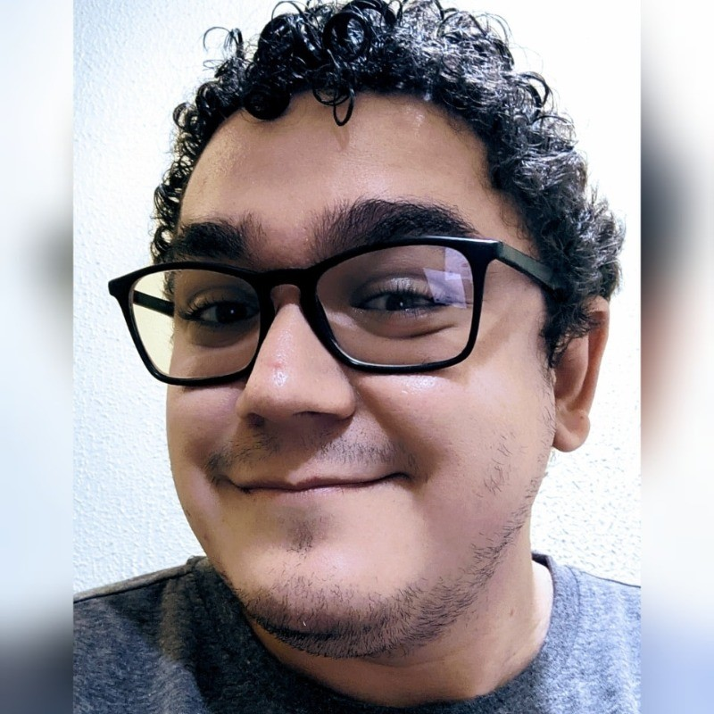

## Olá, eu sou o Waltenne Carvalho

**Sou apaixonado por** automação, CI/CD e infraestrutura em nuvem.

Já atuei em projetos que reduziram em até **30% o tempo de deploy**, automatizando pipelines com **Jenkins e GitLab**, além de criar scripts em **Python** e **Shell Script** para otimizar tarefas e aumentar a confiabilidade dos ambientes.  

Tenho conhecimentos em **AWS, Docker, Jenkins, GitLab CI, Pytho, Shell Script, Grafana e Zabbix**, unindo prática de monitoramento com foco em performance e estabilidade.  

Também participo ativamente das **comunidades**, organizando e apoiando eventos como o **DevOps Days Goiânia** e iniciativas da **PorteraTech**, sempre buscando compartilhar conhecimento e fortalecer o ecossistema.  

---

## 📌 Meus interesses atuais

- Cultura **DevOps** e automação de processos  
- **CI/CD pipelines** e boas práticas de qualidade  
- **Infraestrutura em nuvem** e conteinerização  
- Observabilidade e monitoramento de ambientes  
- **Comunidades técnicas** e organização de eventos  

---

## 📚 Meus artigos 

[Cultura de Qualidade: Responsabilidade de Todos, Não Apenas do QA](https://dev.to/waltenne/cultura-de-qualidade-responsabilidade-de-todos-nao-apenas-do-qa-19e6)

---

## 🌐 Onde me encontrar

- LinkedIn: [waltenne](https://www.linkedin.com/in/waltenne)  
- GitHub: [waltenne](https://github.com/waltenne)  
- Twitter: [@waltenne](https://twitter.com/waltenne)
- Instagram: [@waltenne](https://www.instagram.com/waltenne)
- Bsky: [@waltenne](https://bsky.app/profile/waltenne.bsky.social)

---

## ✨ Curiosidades

- Organizador voluntário em eventos como **DevOps Days Goiânia** e **Portera Day**  
- Dupla formação em **Redes de Computadores** e **Gestão de Sistemas de Informação**  
- Gosto de resolver problemas através de automação e explorar novas ferramentas que aumentem a eficiência  
